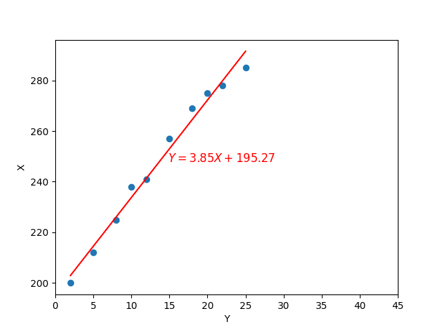
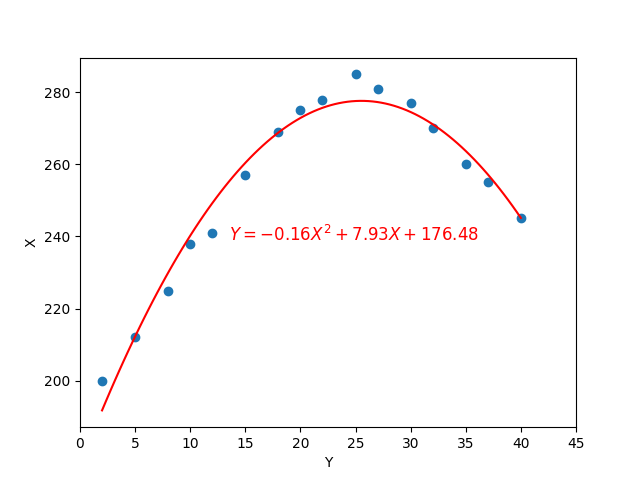
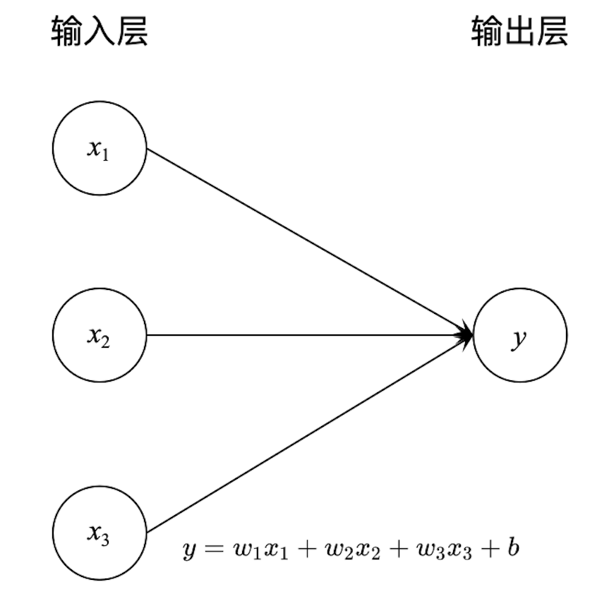

# 相关概念

## 大语言模型(LLM)引爆人工智能(AI)
大语言模型是人工智能的一个分支。人工智能的概念由来以久，涵盖的范围也非常广泛。只不过随着近几年大语言模型的爆发和普及，人工智能才开始进入普通大众的视野。所以，在大众的认知中，人工智能和大语言模型是几乎等同的概念。

大语言模型为什么会如此引爆人工智能呢？因为大语言模型的出现，第一次让AI具有了接近人类水平的语言理解和应答能力，计算机成为一个可以像人一样和其他人对话，而没有出现大规模的概念违和的逻辑错误。**计算机的行为第一次与人类如此相似。** 这使得大语言模型远超了其他人工智能分支，比如人形机器人、自动驾驶等，这些领域所展现出来的产品与人的决策和行为有很多时候相去甚远，带来的体验时常让人觉得“人工智能≈人工智障”。比如，我们经常可以看到人形机器人本色出演吴老二得脑血栓样子。

## 为什么是大语言模型？
其实在大语言模型之前，人工智能已经有了很多分支和进展，比如图像识别、语音识别、自动驾驶等等。但是为什么偏偏是大语言模型而不是其他领域的模型发展引爆人工智能呢？

因为大语言模型处理的对象——语言，是人类交流的信息载体。人类通过语言来表达自己的想法和情感，并通过语言来理解别人的思想和意图。人类脑海中所有的视觉信息、听觉信息、触觉信息、决策信息、行为信息都可以通过语言进行表述。**语言，全方位承载了人类思维逻辑**。因此，大模型通过学习人类语言习惯，就可以具备趋近人类水平的逻辑能力。而其他人工智能分支都局限于自己的领域，在某些领域它们可能做的比人还好，但没有像大语言模型一样全面而突出地展现出“类人的行为”。

**四个字总结：方向选对了！**

## 模型如何学习人类语言习惯？
什么是模型？简单直白一点说，模型就是一个数学式子，用来描述一些对象之间的关系。

### 一个简单的例子，阐述什么是模型以及如何构建模型
比如，我们想知道一块田的施肥量和作物产量的关系。那么我们可以做这样的实验：
 - 将这块田划分为10个大小相同的小块；
 - 在每个小块上施用不同数量的化肥，如： $2$ 公斤、 $5$ 公斤、 $8$ 公斤、 $10$ 公斤、 $12$ 公斤、 $15$ 公斤、 $18$ 公斤、 $20$ 公斤、 $22$ 公斤、 $25$ 公斤；
 - 然后记录每个小块上的作物产量，如得到的结果分别是： $200$ 公斤、 $212$ 公斤、 $225$ 公斤、 $238$ 公斤、 $241$ 公斤、 $257$ 公斤、 $269$ 公斤、 $275$ 公斤、 $278$ 公斤、 $285$ 公斤；
 - 如果我们将施肥量作为 $X$ 轴、作物产量作为 $Y$ 轴绘制到坐标系上，就会发现施肥量和作物产量之间存在一个同增同减(正比)关系。
 - 如果我们用一个式子 $Y=aX+b$ 来表示施肥量和作物产量之间的关系，那么这个式子就是描述作物产量随施肥量变化的规律的模型。其中 $a$ 和 $b$ 是模型参数，可以基于
 上面的实验数据，使用成熟的算法计算得到(后续会讲到计算的方法，这里先不用纠结，反正是能计算)。
 
 这里，我们计算得到： $a=3.85$ ， $b=195.27$ 。那么， $Y=3.85X+195.27$ 就是描述施肥量和作物产量之间的关系的模型。将施肥量 $X$ 和作物产量 $Y$ 以及模型式子 $Y=3.85X+195.27$ 绘制到坐标系上，就会得到如下的图像：

 
从上面的图可以看出，这个模型已经可以较好地描述作物产量随施肥量变化的规律。使用模型来描述规律的好处是：
 - 在描述规律的时候更加简洁，不然的话，我们可能需要用罗列所有的施肥量和作物产量数据(一个非常庞大臃肿的数据表)才能描述清楚它们之间的关系。
 - 我们可以基于模型来做一些推断，比如推算任意施肥量对应的作物产量。

例如，如果我们想知道施肥量 $13$ 公斤对应的作物产量是多少？那么我们只需要将 $X=13$ 代入 $Y=3.85X+195.27$ 中，就可以得到作物产量为 $245.32$ 公斤。这个预测结果当然不会是完全准确的，但我们相信它会非常接近多次实验结果的平均值。

当然，如果开展更多的实验，得到更多的数据，我们也许会发现：施肥量和作物产量之间的关系其实上面描述的要复杂。比如它可能是如下的一个图形：

因为实验数据表达的规律更复杂了，所以我们需要一个更复杂的公式 $Y=0.16X^2+7.93X+176.48$ 来描述施肥量和作物产量之间的关系。

**简单总结1点：(1) 模型的作用是描述数据规律；(2) 数据规律越复杂，就需要模型越复杂。**

### 回到大语言模型，它是如何构建的？
如果我们想让大模型简单地学会几句话，目标是让它可以像鹦鹉学舌一样：人对鹦鹉说“你好”，鹦鹉回答“早上好”；人对鹦鹉说“再见”，鹦鹉回答“吃饭”；人对鹦鹉说“谢谢”，鹦鹉回答“滚蛋”。那么事情就会变得很简单(这里我们尽量使用模型，而不是写一个简单的逻辑判断，因为逻辑判断只能处理已知问题，没有应对新问题的能力)：
 - 将“你好”、“再见”、“谢谢”分别用数字1、3、5表示，作为 $X$；
 - 将“早上好”、“吃饭”、“滚蛋”分别用数字2、4、6表示，作为 $Y$；
 - 构建一个数学式子，比如 $Y=X+1$，就可以很好地完成这个目标。

使用 $Y=X+1$ 这个模型，我们可以很好地描述人与鹦鹉对话的规律，甚至可以使用它预测新的问题：如果人对鹦鹉说“早上好”($X=2$)，鹦鹉会回答“再见”($Y=3$)。当然这个预测可能是错误的。因为在已知的数据中，人们从来没有对鹦鹉说过“早上好”，但从鹦鹉学舌的角度，这里没有发生逻辑错误。

如果我们想要模型远远超越鹦鹉学舌，那么我们需要提供更多的数据，就像之前提供更多的施肥量和作物产量数据一样。比如，人类历史上产生的大量文学作品、学术论文、新闻报道、聊天记录等等。这些非常复杂、丰富的语言文本，构成了大模型需要学习的数据。而由于这些数据规律非常的复杂，所以进一步需要我们构建一个非常复杂的模型来描述它，就像是上面施肥量与作物产量的关系模型由一条直线演变成一条更复杂的抛物线一样。

**深度神经网络**就是一种非常复杂的数学式子，因此人们用它来构建大语言模型。

自然而然地，我们可以将那些文本数据拆解成一个个的词元(词元是比字更小的单元，就像字典中所有字的偏旁部首一样，有限的词元可以组合成非常多的文字)，并将这些词元使用数字编号，形成词表(每个词元对应一个数字编号)。比如：一段文字组成的文本可能被编号成 $[35, 12, 1567, 231, 4798, 9815, ...]$ 。

如果我们想让大模型学习的规律与鹦鹉学舌一样：如果给出文本的前半部分 $X$ ，请大模型输出文本后半部分 $Y$ 。那么这里的 $Y$ 会非常复杂，因为它是一段文本，由多个词元组成，而每个词元都有很多种可能的取值。假设词表中词元的总个数是 $10000$ 个， $Y$ 是一段有 $100$ 个词元组成的文本，那么对 $Y$ 的预测结果就有 $10000^{100}=10^{400}$ 种可能性。这个数字太大了，是一个比全宇宙的原子总数量(约为 $10^{80}$ 个)都大的多的多的多的数字。要从这么多可能性中找出最可能的预测结果，就需要的模型复杂程度难以想象。毕竟构建复杂模型是为了解决复杂问题，而不是单纯为了构建复杂模型。

为降低问题的复杂性，我们可以这样修改对大模型的期望：“如果给出句子的前半部分 $X$，请大模型输出接下来的一个词元 $Y$ 。这里的 $Y$ 就简单多了，只代表单个词元，每次预测也只有 $10000$ 种可能的结果”。那如何预测文本的后半部分呢？很简单，我们只需要将预测得到的词元 $Y$ 合并到 $X$ 的末尾再次作为输入，让大模型继续输出下一个词元 $Y$ 。如此反复，直到得到全部的文本输出结果。

所以，大语言模型的构建问题就变成了：找一个足够复杂的数学式子作为模型，找出最佳的模型系数(类似之前施肥量和作物产量模型中的 $a$ 、 $b$)，使其在给定“一组词元”的情况下输出的“下一个词元”最符合人类语言规律。

为了简化理解，这里可以假设一个汉字就是一个词元。如果我们有一组如下的文本数据集，代表了人类思维的习惯：
 - 下班了，妈妈喊我回家吃饭。
 - 放学了，妈妈喊我回家吃饭。
 - 玩够了，妈妈喊我回家吃饭。
 - 种完稻谷，妈妈喊我回家吃饭。
 - 放羊回来了，妈妈喊我回家吃馕。
 - 麦子收完了，妈妈喊我回家吃面条。
 - 放下镰刀，妈妈喊我回家吃面条。

假设我们按照之前所说的步骤，构建了一个大语言模型，用来生成文本。观察上面的文本规律，可以看出，“妈妈喊我回家吃”这段文本后面词元总有有3种选择——“饭”、“馕”、“面”。当只给定 $X=$ “妈妈喊我回家吃”的时候，我们希望大模型输出的下一个词元 $Y=$ “饭”。因为在这个数据集中，“妈妈喊我回家吃”后面紧接着的次元有(4/7=)57.1%的概率都是“饭”，属于概率最高也最合理的结果。但如果给定的是 $X=$ “放羊回来了，妈妈喊我回家吃”的时候，我们就可能希望大模型输出的下一个词元 $Y=$ “馕”。因为在这个数据集中，“放羊回来了，妈妈喊我回家吃”后面紧接着的词元有(1/1=)100%的概率都是“馕”，属于概率最高也最合理的结果。更进一步，如果我们给定的是 $X=$ “割完麦子，妈妈喊我回家吃”的时候，我们希望大模型输出的下一个词元 $Y=$ “面”。因为，从语义上看，“收麦子”这件事情(包括“割完麦子”、“麦子收完了”和“放下镰刀”)与“妈妈喊我回家吃面条”是应该合理地匹配在一起的(模型需要大量的文本来发现这种匹配规律)。学习文本数据集的原有知识(前2个例子)，理解知识并泛化到新的场景(后1个例子)，这就是大语言模型的核心能力。

**综上所述，大语言模型本质上是：设置一个足够复杂的数据模型(深度神经网络)，将大量的人类文本(语料数据集)转换成数字编号输入到模型中帮助找到最佳的参数(学习或称为训练)，使得模型在收到一段文本(上文)时，输出的下一个词元(下文)为最合理(最符合人类语言习惯和思维逻辑)。**

## 什么是深度神经网络？
如果从互联网或者教科书中找关于“神经网络”模型的定义，我们很可能会找到这样的描述：神经网络模型是一种模仿生物神经系统工作方式的计算模型，用于模拟人类大脑处理信息的方法。它由大量的节点（或称神经元）组成，这些节点通过连接权重相互连接形成一个网络。每个神经元接收来自其他神经元的输入信号，经过内部处理后产生输出信号，并将此输出传递给下一层的神经元。

类似上面关于神经网络定义的定义有很多，基本上都是大同小异。但其实类似这种定义不仅不正确，而且也没有什么卵用。所以，上面这段话，我们完全可以跳过不看。理由是：人类大脑处理信息的机制和原理现在还是未知的，神经网络模型的这种模仿比画👻还不靠谱。

所以，我们需要从具体的结构出发来理解神经网络模型。神经网络通常分为三类主要层：
 - 输入层：接收数据 $X$，并将其传递给隐藏层；
 - 隐藏层：位于输入层和输出层之间，可以有一个或多个。隐藏层中的神经元负责对输入数据进行各种计算；
 - 输出层：负责产生最终结果 $Y$。

但隐藏层并不是必须的，比如我们可以构建一个只有输入层和输出层的神经网络模型：

如果我们觉得这个模型不够复杂，我们可以在线形模型的基础上增加一个在深度学习中常用的非线性变换(被称作激活函数，实际上就是为了引入非线性)：

$$y = \text{ReLU}(w_1x_1 + w_2x_2 + w_3x_3 + b)$$

其中， $\text{ReLU}(x) = \max(0, x).$ 是众多激活函数中的一种。

如果我们觉得这样还不够，那还可以加入隐藏层，以有2个隐藏层的神经网络为例，它的结构可以如下图所示(我们还可以设置输出 $y$ 也不再是1个，而是2个甚至可以是更多个，常见于分类场景)：

其中， $x$ 为输入层， $h_1, h_2$ 为隐藏层， $y$ 为输出层； $w$ 和 $b$ 为模型参数； $f$ 为激活函数(就像前面提及的 $\text{ReLU}$ 一样，是一个预先定义好的非线性函数)。

让我们对上述变量赋以具体的含义，以便更好地理解神经网络模型是如何工作的：假设 $x_1, x_2, x_3$ 分别是某高中每个学生最后一次模拟考试的数学、语文和英语成绩， $y$ 则是该学生最终是否考上本科的结果( $y_1=1, y_2=0$ 表示考上了， $y_1=0, y_2=1$ 表示没考上)。我们希望构建一个模型，通过学生的模拟考试成绩来预测其是否能够考上本科。假设我们就构建了如上的一个神经网络，同时我们已知上一届的2000千名学生的模拟考试成绩和最终是否考上本科的结果，那么我们就可以用这个数据集来训练我们的模型。因为 $f$ 是人为定义的， $h_1, h_2$ 都是基于其他数值计算而来的，只有 $w$ 和 $b$ 是未知的，所以我们只需要根据现有的数据集，找到最佳的 $w$ 和 $b$ (有很多现成的方法帮助我们找到它，这一点后续会讲到)，使得当输入已知的 $x$ 时，输出的 $y$ 最接近真实值即可。然后，我们就可以使用这个模型来，输入本届某位学生最后一次模拟考试的数学、语文和英语成绩，从而预测出他是否能够考上本科(此时输出的 $y_1, y_2$ 是两个概率。比如， $y_1=0.95, y_2=0.05$ ，即 $y_1>y_2$ 表示该学生考上本科的概率比考不上本科的概率更大，因此可以预测认为该学生能够考上本科)。

当然，除了激活函数和隐藏层，神经网络还有很多其他办法来增加模型的复杂度，比如卷积层、池化层、注意力机制、门控开关等等。这些在后续的内容中也许会涉及到。

现在我们已经了解了什么是神经网络模型，那什么是深度神经网络呢？深度神经网络就是指有很多层(也就是很深，有的甚至有上百层)的神经网络模型。至于其深度应该被设置为多少，那就需要根据具体的应用场景和实际效果来决定了。

## 参数是如何计算的？
到目前为止，我们还有一个问题没有解决，那就是前面所提及的模型参数 $w$ 和 $b$ 是如何计算得到的？模型参数的计算过程，也就是我们通常所说的“训练”或“学习”。

我们还是从一个最简单的例子开始，假设收集到的施肥量和作物产量数据如下：
 - 施肥量 $X$ ： $2$ 公斤、 $5$ 公斤、 $8$ 公斤；
 - 作物产量 $Y$ ： $200$ 公斤、 $212$ 公斤、 $225$ 公斤。

我们构建的的模型是 $Y=wX+b$ ，其中 $w, b$ 是模型参数，需要我们通过上面的数据学习得到。

让我们首先回到计算 $w, b$ 的目的上来：找到最佳的 $w, b$ 取值，使得模型在给定施肥量的情况下，输出的作物产量最接近真实值。也就是说，我们希望下面的式子尽可能小：
$$l = \sum_{i=1}^{3} (Y_i - wX_i-b)^2 = (200-2w-b)^2 + (212-5w-b)^2 + (225-8w-b)^2$$

上面这个函数即是我们常说的“损失函数”。当然损失函数还有很多其他的形式，只要能表述模型预测结果与真实结果之间的差距即可。

如何使得损失函数尽可能小呢？我们可以使用梯度下降算法。所谓梯度，即 $l$ 函数对 $w, b$ 的偏导数：

$$\frac{\partial l}{\partial w} = -2 \times (2 \times (200 - 2w - b) + 5 \times (212 - 5w - b) + 8 \times (225 - 8w - b))$$
$$\frac{\partial l}{\partial b} = -2 \times (200 - 2w - b) - 5 \times (212 - 5w - b) - 8 \times (225 - 8w - b)$$

梯度下降算法的基本思想是：当 $l$ 函数满足一定特性的时候，从 $w, b$ 的一个初始点开始，沿着梯度的反方向(即梯度前面加一个负号/减号)逐步按一定幅度 $r$ 更新参数： $w = w - \frac{\partial l}{\partial w}r, b = b - \frac{\partial l}{\partial b}r$ ，就可以找到 $l$ 的最小值。其中， $r$ 就是我们常说的学习率，它决定了每次参数更新的幅度。

按照上面所说的计算方法，我们可以一步步计算：
 - 初始化模型参数 $w=0, b=0$ (也可以不是 0)，设定学习率为 $r = 0.001$ (学习率太小的话，会导致参数更新速度太慢，迭代很多轮也达不到损失函数最小值附近——小碎步挪的像个太监；学习率太大的话，可能会一不小心跳过损失函数的最小值——步子太大扯了蛋。所以，一般都根据经验选择一个比较合适的学习率，或者根据根据训练情况实时调整学习率)；
 - 第1轮迭代：将初始化的模型参数 $w=0, b=0$ 代入中的前面提及的梯度(偏导数)计算公式中，得到梯度计算结果 $\frac{\partial l}{\partial w}=-6520.00, \frac{\partial l}{\partial b} = -1274.00$ ，基于梯度下降办法更新参数 $w = 0 - (-6520.00) \times 0.001 = 6.25, b = 0 - (-1274.00) \times 0.001 = 1.27$ ，参数更新之后的的损失函数  $l = 95643.05$ ；
 - 第2轮迭代：将第1轮计算的模型参数结果 $w=6.25, b=1.27$ 代入中的前面提及的梯度(偏导数)计算公式中，得到梯度计算结果 $\frac{\partial l}{\partial w}=-5269.06, \frac{\partial l}{\partial b} = -1070.76$ ，基于梯度下降办法更新参数 $w = 6.25 - (-5269.06) \times 0.001 = 11.79, b = 1.27 - (-1070.76) \times 0.001 = 2.34$ ，参数更新之后的的损失函数  $l = 69488.20$ ；
 - ......
 - 第1000轮迭代：将第999轮计算的模型参数结果 $w=13.891, b=131.578$ 代入中的前面提及的梯度(偏导数)计算公式中，得到梯度计算结果 $\frac{\partial l}{\partial w}=11.004, \frac{\partial l}{\partial b} = -67.812$ ，基于梯度下降办法更新参数 $w = 13.891 - (11.004) \times 0.001 = 11.79, b = 131.578 - (-67.812) \times 0.001 = 131.646$ ，参数更新之后的的损失函数  $l = 2080.678$ ；
 - ......
 - 第10000轮迭代：将第9999轮计算的模型参数结果 $w=4.167, b=191.498$ 代入中的前面提及的梯度(偏导数)计算公式中，得到梯度计算结果 $\frac{\partial l}{\partial w}=0.000, \frac{\partial l}{\partial b} = -0.003$ ，基于梯度下降办法更新参数 $w = 4.167 - (0.000) \times 0.001 = 4.167, b = 191.498 - (-0.003) \times 0.001 = 191.498$ ，参数更新之后的的损失函数  $l = 0.167$ 。
 
我们看到经过10000轮迭代，损失函数已经很小了，可以说模型参数 $w=4.167, b=191.498$ 已经足够好(实际上在满足一定条件时，比如损失函数 $l$ 在两轮迭代之间的变化小于某个阈值，我们就可以让这个反复迭代计算的过程提前结束)。当然，如果觉得模型参数还不够好，则可以继续迭代计算，直到损失函数满足一定的条件为止。

当然，上面的模型非常简单，实际上有更简单、更显式的方法来计算 $w, b$ ，比如最小二乘法。但在深度神经网络中，因为模型非常复杂，所以需要使用梯度下降算法来计算 $w, b$。而且为了应对庞大的数据量，我们可能用到随机梯度下降、小批量梯度下降等优化算法；为避免梯度消失或爆炸的问题，可能还需要用到一些其他的技巧，比如批量归一化、残差连接、权重衰减等等；为了避免过拟合的问题，可能还需要用到一些正则化技术，比如Dropout、L1/L2正则化等等。这些具体的技术细节，我们后续遇到时讲解。

**总之，我们在这里了解了模型是什么、大语言模型的构建方法、模型训练方法，为后续大语言模型的进一步探讨奠定了基础。**

## 深度学习框架与模型层

大语言模型的“大”是指模型包含多个层。正如前面所说的，这些层的核心作用是增加模型的复杂度，从而可以适应更复杂的任务。如果模型的每一层都需要我们手动编写代码来实现，那将是一件非常繁琐且容易出错的工作。因此，深度学习框架应运而生。它们提供了大量的预定义层和模块，这些层和模块可以被组合起来，以构建复杂的神经网络模型，并且可以自动处理诸如参数更新、梯度计算等底层细节，使得我们能够快速构建复杂的神经网络模型。当这些层和模块的功能不足以满足我们的需求时，我们可以在他们的基础上按照规则自定义层和模块，并与现有的层和模块无缝集成。

例如，上面提到的最简单的线性模型，我们可以使用 PyTorch 框架中的 nn.Linear 类来实现：nn.Linear(input_dim, output_dim)。其中 input_dim 是输入层特征的维度，output_dim 是输出层特征的维度，参数 $w, b$ 被定义在其中，我们不再需要手动定义它们及其计算公式，因为这个类已经帮我们定义好了一个 forward 方法。当我们将数据输入到这个模型中时，它会自动调用 forward 根据参数 $w, b$ 计算输出。

不仅是线性层 nn.Linear，PyTorch 还提供了大量的诸如嵌入层 nn.Embedding、Dropout正则化层 nn.Dropout 等，以实现不同功能的神经网络层。另外，还有参数管理方法 nn.Parameter 用于管理模型参数；nn.functional 模块提供了大量的激活函数、损失函数等，以实现不同的功能。

使用这些层，我们只需要将它们按照特定的顺序组合起来(可能是先组合成块，再将块组合成模型)，即可构建出复杂的大语言模型。

后面，我们将对使用到的层(如PyTorch中预定义的嵌入层、线性层、激活函数，自定义的正则化层，以及上述层组成的块)进行详细的介绍。

