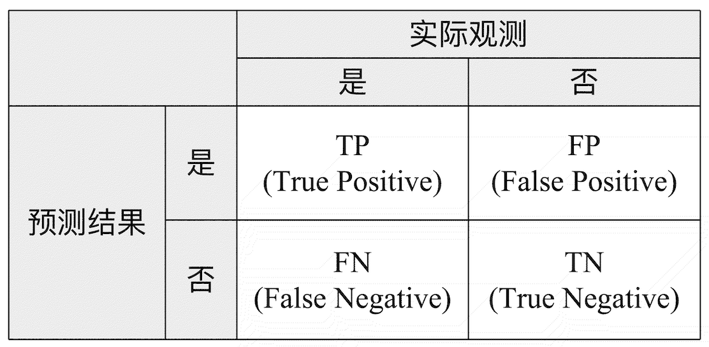
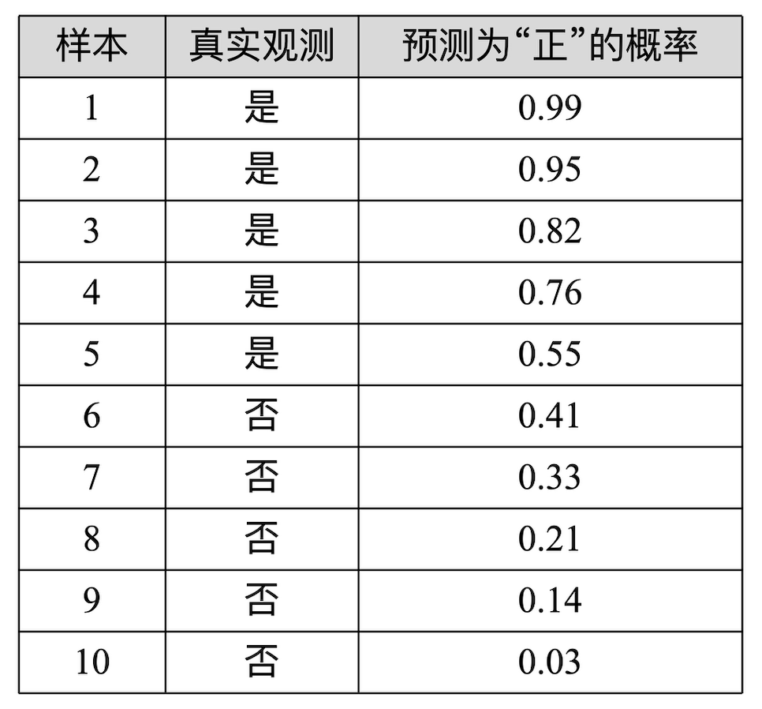
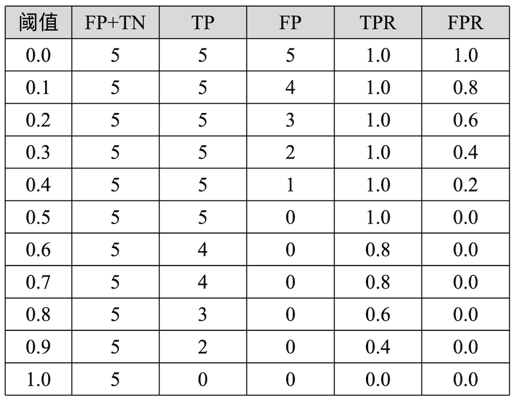
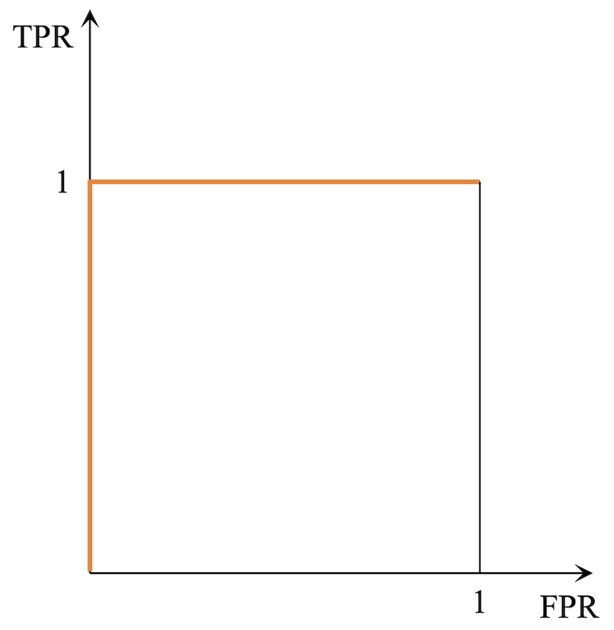
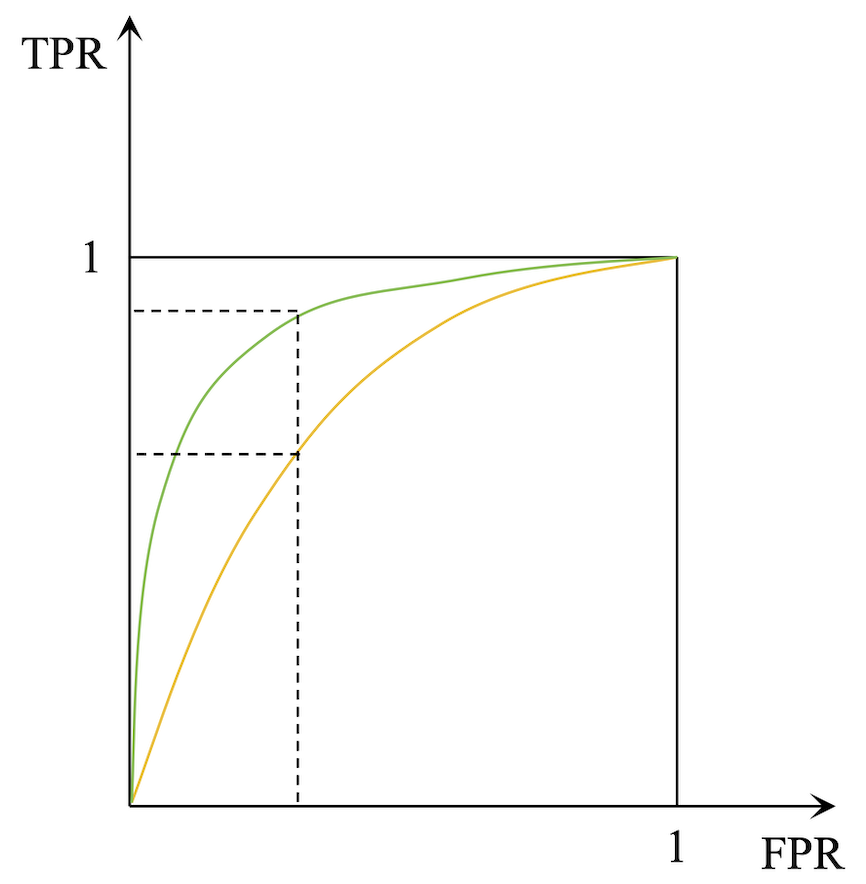

# 分类模型评价指标

衡量分类模型最常见的指标有：准确率与召回率，准确度，F1值，ROC曲线，AUC值。

## 混淆矩阵

混淆矩阵 (Confusion Matrix) 是按照真实类别和预测类别对样本进行归类计数得到的矩阵，用于评估分类模型的性能。

其中，TP 表示实际为“是”预测为“是”(真阳性)的样本数量；TN 表示实际为“否”预测为“否”(真阴性)的样本数量；FN 表示实际为“是”预测为“否”(假阴性)的样本数量，也就是漏报数量；FP 表示实际为“否”预测为“是”(假阳性)的样本数量，也就是误报数量。

## 准确率与召回率

机器学习领域最常见的指标是准确率(Precision Rate)和召回率(Recall Rate)。准确率是指预测为“是”的样本中，实际为“是”的比例：

$$\text{准确率}=\frac{TP}{TP+FP}$$

准确率指标被用于那些假阳性(FP)代价较高的场景下，比如垃圾邮件检测，TP表示正确识别的垃圾邮件数量，FP表示被错误标记为垃圾邮件的正常邮件数量。用户非常不希望正常的邮件被误判为垃圾邮件，所以FP越小越好。

召回率是实际为“是”的样本中，预测为“是”的比例:

$$\text{召回率}=\frac{TP}{TP+FN}$$

召回率关心的是在所有实际为正类的样本中，模型能够正确识别出多少。比如流行病检测，TP表示正确识别的患病病人数量，FN表示漏诊的病人数量。医生非常不希望漏掉任何一个患病的病人，召回率越高越好。

## 准确度与F1值

准确度(Accuracy)是分类模型预测正确的样本数量与总样本数量的比例:

$$\text{准确度}=\frac{TP+TN}{TP+TN+FP+FN}$$

F1值是准确率和召回率的加权调和平均数，F1值越大越好:

$$\text{F1值}=\frac{2 \times \text{准确率} \times \text{召回率}}{\text{准确率}+\text{召回率}} = \frac{2TP}{2TP+FP+FN}$$

## ROC曲线与AUC值

ROC曲线(Receiver Operating Characteristic Curve)是一种常用的分类模型性能评估工具，它通过绘制不同阈值下的真正率(TPR)和假正率(FPR)来展示模型的性能。

其中真正率(TPR)即召回率，是实际为“是”的样本中，预测为“是”的比例：

$$TPR=\frac{TP}{TP+FN}$$

假正率(FPR)是实际为“否”的样本中，预测为“是”的比例：

$$FPR=\frac{FP}{FP+TN}$$

可以看出， $TPR$ 和 $FPR$ 两个指标的分母 $FP+TN$ 即为实际为“否”的样本总数(假设总样本为100，实际为“是”和“否”的样本数各为50)，分子 $TP$ 和 $FP$ 之和即为预测为“是”的样本数量。当我们给定一个判断预测结果为“是”或“否”的阈值时，对所有的样本，可以根据阈值计算出对应的 $TP$ 和 $FP$ ，从而得到 $TPR$ 和 $FPR$ 的值：

 - 当阈值为 1 时，所有的样本都被预测为“否”，此时 $TP=0$ ， $FP=0$ ，进而得到 $TPR=0$ ，$FPR=0$；
 - 当阈值逐渐减少，如减少为0.5，有部分样本被预测为“是”，假设此时 $TP=40$ 和 $FP=15$ ，进而得到 $TPR=0.8$ 和 $FPR=0.3$ 的值。
 - 当阈值为 0 时，所有的样本都被预测为“是”，此时 $TP=50$ ， $FP=50$ ，进而得到 $TPR=1$ ，$FPR=1$。

在每个给定的阈值下，计算对应的 $TPR$ 和 $FPR$ ，然后以 $FPR$ 为横轴、 $TPR$ 为纵轴将它们绘制在坐标系中，就得到了ROC曲线。

ROC曲线越靠近左上角，模型的性能越好。理想的模型ROC曲线应该是一条从左下角到右上角的直线，即 $FPR$ 和 $TPR$ 都为1时，模型的性能最好。例如我们有如下样本及预测概率：

根据 $TPR$ 和 $FPR$ 的定义，我们选用不同的阈值，可以得到如下 $TPR$ 和 $FPR$ 的值：

可以看到，当阈值小于0.55时，$TPR = 1$ ； 而当阈值大于0.55时，$FPR = 0$ 。如果将这些数据(或者取更多的阈值得到更多的数据)绘制到坐标系中，就得到了如下的ROC曲线：

这个时候，模型的性能最好。因为此时我们可以找到一个阈值，能够将所有的样本都正确地分类。

为什么 ROC 曲线越靠近左上角，模型的性能越好呢？我们可以参照下图，假设我们有如下两条 ROC 曲线：

可以看出，同样的 $FPR$ 值下，越靠近左上角的 ROC 曲线的 $TPR$ 值越大。而 $TPR$ 代表实际为“是”的样本中，预测为“是”的比例； $FPR$ 代表实际为“否”的样本中，预测为“是”的比例。所以，在相同的预测**错误代价**( $FPR$ )下，越靠近左上角的 ROC 曲线代表着召回率(收益)越高。

如果我们要找一个指标衡量 ROC 曲线是否靠近左上角，那么 AUC 值是一个很好的选择。AUC 值为 ROC 曲线下的面积，即ROC曲线的积分值。AUC 值的取值范围为0.5到1之间，越大越好。当 AUC 值为 1 时，即 ROC 曲线是一条从左下角到右上角的直线，表示模型是一个完美的分类器；当 AUC 值为 0.5 时，表示模型时一个没有区分能力的分类器，其预测结果与随机猜测无异。

虽然AUC的直观含义是ROC曲线下方的面积，但实际计算时并不需要真正画出ROC曲线。以下是两种常见的计算AUC的方法：

 - 梯形法则：首先，根据不同的阈值计算对应的TPR和FPR，得到一系列点；然后，使用这些点来近似计算曲线下面积。对于每一对相邻的点，可以视为形成了一个小的梯形或矩形，其面积可以通过梯形面积公式计算；最后，将所有小梯形或矩形的面积相加，即可得到整个ROC曲线下的面积，即AUC。
 - Wilcoxon-Mann-Whitney统计量：AUC实际上等价于Wilcoxon-Mann-Whitney U检验的统计量，也可以理解为从两个分布（正样本和负样本）中分别随机抽取一个样本，正样本的评分高于负样本的概率。基于此原理，可以通过比较正负样本的预测得分来计算AUC。具体步骤为：对所有的正样本和负样本，首先获取它们的预测概率分数；计算所有正样本的预测分数大于负样本的预测分数的比例。这个比例即为AUC的值。如果存在相同的分数，则需要适当调整计算方式以处理平局情况。