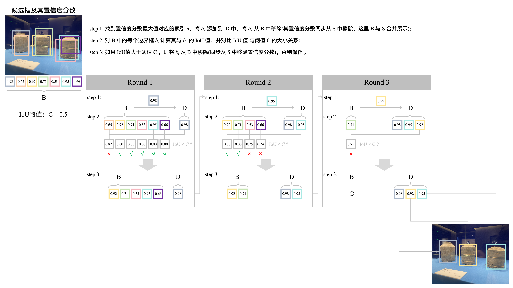

# 非极大抑制算法

非极大抑制算法是一种用于目标检测和图像分割的常用算法，用于去除冗余的检测框。虽然这个算法在大语言模型中并罕有应用，但如果想比较全面地了解深度学习技术，还是需要稍微了解一下。

所有的目标检测算法都包括以下三个步骤：

 - 第1步：利用滑动窗口提取一个窗口的搜索空间；

 - 第2步：用分类器或者回归器对窗口进行置信度评估；

 - 第3步：利用非极大值抑制算法合并每一个对象的边界框。

 目标检测算法，会在第一步中为每个目标识别对象确定不止1个边界框，但是最后进行目标识别结果输出的时候，仅仅需要一个边界框。这个时候，就需要去找出一个最有利于目标识别的框来进行目标识别。非极大值抑制算法就是实现“由多到一”过程的一种算法。

## 算法原理

假设得到了一组候选框(第1步的结果) $B = {b_1, b_2, ..., b_N}$ ，每个候选框都对应有一个置信度分数(第2步的结果) $S = {s_1, s_2, ..., s_N}$ 。非极大值抑制算法的步骤如下：

 - 设置交并比(IoU，两个边界框交集面积与并集面积的比率，用来衡量两个框的重叠程度)阈值 $C$；
 - 初始化一个空集合 $D = {}$，用来存放最终的边界框结果；
 - 如果 $B$ 为非空，则执行以下步骤：
    - 找到 $S$ 中置信度分数最大值对应的索引 $n$ ；
    - 将 $b_n$ 添加到集合 $D$ 中；
    - 将 $b_n$ 从集合 $B$ 中移除；
    - 将 $s_n$ 从集合 $S$ 中移除；
    - 对于集合 $B$ 中的每个边界框 $b_i$ ，计算其与 $b_n$ 的IoU值；
        - 如果IoU值大于阈值 $C$ ，则将 $b_i$ 从集合 $B$ 中移除，将 $s_i$ 从集合 $S$ 中移除；
    - 重复上述步骤，直到集合 $B$ 为空。
 - 返回集合 $D$ ，即为最终的边界框结果。

其中， IoU 的计算公式为：

$$IoU = \frac{b_n \cap b_i}{b_n \cup b_i}$$

其中， $b_n \cap b_i$ 表示 $b_n$ 和 $b_i$ 的交集面积， $b_n \cup b_i$ 表示 $b_n$ 和 $b_i$ 的并集面积。

## 具体案例

<div align="center">

</div>

```python
import numpy as np

def IoU(target_box, boxes):
    """
    计算一个target_box与多个boxes之间的 IoU。
    
    参数:
    target_box (list or tuple): 目标边界框 [x1, y1, x2, y2]
    boxes (list of lists): 参考边界框 [[x1, y1, x2, y2], ...]
    
    返回:
    list: 每个参考边界框相对于目标边界框的 IoU 值
    """
    def iou_single(box1, box2):
        x1 = max(box1[0], box2[0])
        y1 = max(box1[1], box2[1])
        x2 = min(box1[2], box2[2])
        y2 = min(box1[3], box2[3])

        # 计算交集区域的宽高
        w = max(0, x2 - x1)
        h = max(0, y2 - y1)
        inter_area = w * h

        # 各自区域面积
        area_box1 = (box1[2] - box1[0]) * (box1[3] - box1[1])
        area_box2 = (box2[2] - box2[0]) * (box2[3] - box2[1])

        # 并集面积
        union_area = area_box1 + area_box2 - inter_area

        # 防止除以零
        if union_area == 0:
            return 0.0

        return inter_area / union_area

    ious = []
    for box in boxes:
        iou_val = iou_single(target_box, box)
        ious.append(iou_val)
    
    return np.array(ious)

def NMS(B, S, C=0.5):
    """
    非极大抑制算法，用于筛选出具有最高置信度的候选框。

    参数:
    B (numpy.ndarray): 候选框数组，形状为 (N, 4)，其中 N 是候选框的数量，每个候选框由四个坐标值表示 [x1, y1, x2, y2]
    S (numpy.ndarray): 置信度分数数组，形状为 (N,)，每个元素表示一个候选框的置信度分数
    C (float, optional): 置信度阈值，默认为 0.5。如果候选框的置信度分数小于此阈值，则将其删除。
    返回:
    numpy.ndarray: 筛选出的候选框数组，形状为 (M, 4)，其中 M 是筛选后候选框的数量
    """
    
    # 初始化 D 为二维空数组
    D = np.empty((0, 4), dtype=B.dtype)
    round = 0

    # 如果 B 不为空，则循环执行以下操作
    while B.size > 0:
        round += 1
        print(f"第{round}轮 --------------------------------------------------------")
        print(f"初始B: {B}")
        print(f"初始S: {S}")
        # 从 S 中提取置信度分数最大值所对的索引
        max_index = np.argmax(S)
        print(f"置信度分数最大值的索引: {max_index}")
        # 从 B 中提取置信度分数最大值所对应的候选框
        max_box = B[max_index]
        print(f"置信度分数最大值所对应的候选框(选定候选框): {max_box}")
        # 使用 np.vstack 将新的候选框添加到 D 中
        D = np.vstack((D, max_box))
        print(f"新增选定候选框后的D: {D}")
        # 从 B 和 S 中删除置信度分数最大值所对应的候选框
        B = np.delete(B, max_index, axis=0)
        S = np.delete(S, max_index)
        print(f"删除选定候选框后的B: {B}")
        print(f"删除选定候选框后的S: {S}")

        # 计算 max_box 与 B 中所有候选框的 IoU
        ious = IoU(max_box, B)
        ious = np.array(ious)
        print(f"选定候选框与其他候选框的IoU: {ious}")
        # 找到 IoU 大于 C 的框的索引
        iou_indices = np.where(ious > C)[0]
        print(f"IoU大于C的框的索引: {iou_indices}")
        # 从 B 和 S 中删除 IoU 大于 C 的框
        B = np.delete(B, iou_indices, axis=0)
        S = np.delete(S, iou_indices)
        print(f"删除IoU大于C的框后的B: {B}")
        print(f"删除IoU大于C的框后的S: {S}")

    # 返回最终的候选框数组
    return D

# test
if __name__ == "__main__":
    # 候选框
    B = np.array([[20, 50, 60, 110], 
                  [22, 52, 58, 114],
                  [65, 52, 110, 114],
                  [70, 45, 112, 112],
                  [120, 60, 185, 125],
                  [125, 52, 190, 123],
                  [126, 53, 193, 108]])
    # 置信度分数
    S = np.array([0.98, 0.65,0.92, 0.71, 0.53, 0.95, 0.66])
    # 非极大抑制算法筛选出最终的候选框
    D = NMS(B=B, S=S, C=0.5)
    # 输出最终的候选框
    print(f'最终的候选框: {D}')
```


