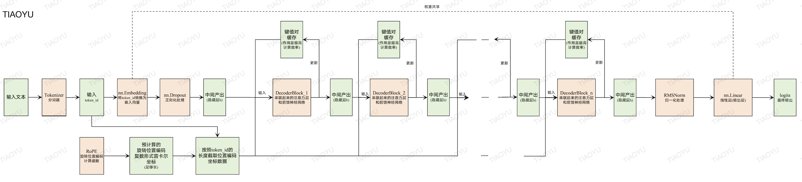

# 模型构建

这里我们先简单介绍一下大语言模型的构建过程，让大家对大语言模型的整个训练和调优过程有一个概念性的了解，具体的细节将在后续章节中详细阐述。

大语言模型的构建过程，主要包括以下个步骤：
 - 数据收集与处理
 - 分词器模型
 - 模型构架
 - 模型预训练
 - 模型再训练
   - 有监督微调
   - 人类反馈强化学习
   - LoRA
   - 知识蒸馏
   - 推理模型训练

其中，数据收集与处理、分词器模型训练、模型选择与搭建与预训练是预训练大模型的通用流程，而有监督微调、人类反馈强化学习、LoRA、知识蒸馏和推理模型训练等后续步骤则是针对特定任务、特定目的进行微调或优化的过程，其中也会包括数据处理、分词器模型使用、模型调整等环节。

## 数据收集与处理

大语言模型的训练需要大量的文本数据作为输入，包括人类自然语言、其他大模型生成的文本、计算机代码等所有逻辑正确的文本形式数据。我们可以从互联网、书籍、代码库等来源中收集这些数据。

数据收集和处理的关键是确保数据的**质量**和**多样性**：
 - **质量**：数据应尽可能准确、完整，避免包含语法错误或逻辑不正确的文本；
 - **多样性**：数据应涵盖各种主题、风格甚至多种语言，以帮助模型学习到更广泛的知识。

通常情况下，我们收集到的数据和处理之后的数据可以保存成JSON格式的文件，每个文件包含多个样本数据，每个样本数据是一个字典对象，如下所示：

```json
{"text": "<s>床前明月光，疑是地上霜。举头望明月，低头思故乡。</s> <s>锄禾日当午，汗滴禾下土。谁知盘中餐，粒粒皆辛苦。</s>"}
{"text": "<s>群众是真正的英雄，而我们自己则往往是幼稚可笑的，不了解这一点，就不能得到起码的知识。</s> <s>星星之火，可以燎原。</s>"}
{"text": "<s>在科学上没有平坦的大道，只有不畏劳苦沿着陡峭山路攀登的人，才有希望达到光辉的顶点。</s> <s>一步实际运动比一打纲领更重要。</s>"}
```
其中，`<s>`和`</s>`是预先人为定义的特殊的标记符号，分别表示文本的开始和结束。

## 分词器模型

虽然我们已经拿到了大量的文本数据，但还不能直接被大语言模型所使用，因为它们目前还是纯文本形式，而大模型本质上是数学公式，需要先将文本转换为数字表示，才能被模型所使用。分词器模型就是用来完成这个任务的。

分词器可以将文本拆分成一个个词元，然后将每个词元映射到一个唯一的数字ID。这样，文本就被转换成了数字序列，可以被大语言模型所使用了。常见的分词器模型有：
 - BPE（Byte-Pair Encoding）：用于创建子词单位（subword units）的分词器；
 - WordPiece：与BPE类似，但使用了稍微不同的方法来选择要合并的子词对；
 - Unigram：一种基于概率的方法，可以视为对WordPiece的泛化；
 - CharBPETokenizer：基于字符级别的BPE，适用于各种形态丰富的语言(如土耳其语)。

总之，利用分词器模型，我们就可以将文本数据转换成数字序列，用于大语言模型的训练和推理了。在后面的章节中，我们将以BPE为例，详细介绍其工作原理和应用。

## 模型构架

Transformer是目前最流行的大语言模型架构，互联网上已经充斥着对它的各种介绍。但这些介绍不仅对理解大语言模型没有帮助，而且很容易让人彻底对理解大语言模型构架失去信心，因为Transformer的架构图绘制的太抽象了，所以我建议大家不要看它。

这里，我们对TIAOYU大语言模型的结构做一个具体、简单介绍，让大家对大语言模型有一个直观的认识。

<div align="center">

</div>

**(1) 分词**: 这是模型的起点，负责将文本数据转换为模型可以理解的数字形式，即 token_id。[「分词器介绍」](3-分词器.md)
**(2) 嵌入**: 将token_id转换为嵌入向量。[「嵌入层介绍」](4-嵌入层.md)[「Dropout介绍」](5-正则化.md)[「位置编码介绍」](6-位置编码.md)
**(3) 解码器模块**: 由多个解码器模块组成，每个模块都包含自注意力机制和前馈神经网络。这些层使得模型能够理解文本的上下文信息，并生成连贯的语言输出。[「解码器模块」](9-解码器模块.md)[「自注意力机制」](10-多头掩码自注意力机制.md)[「前馈神经网络」](11-MOE前馈神经网络.md)
**(4) 输出**: 解码器层的输出结果通过线性层(与(2)中的嵌入层共享权重)转换为最终的输出，用于生成文本。[「归一化介绍」](7-归一化.md)[「线性层介绍」](8-线性层.md)

## 模型预训练

模型预训练可以理解为在机器学习或深度学习领域中，为了让模型能够更好地解决特定问题而进行的一种前期准备工作。这个过程就像是给模型提供了一个“基础教育”，让它先学习一些通用的知识和技能，然后再针对具体任务进行专门的培训。

在深度学习中，尤其是自然语言处理（NLP）领域，预训练通常指的是首先使用大量的文本数据训练一个语言模型，使其学会语言中的词汇、语法结构以及语义信息等基础知识。预训练文本数据具有三方面的特点：规模大、多样性、无标签。预训练模型可以捕捉到语言的许多通用特征，如词汇意义、语法结构、语义关系、上下文信息、长距离依赖、情感倾向、主题关联。预训练之后的模型具有一个特点：**可以进行合乎常识的词语接龙**。

然后，我们可以将这个预训练好的模型用作起点，针对特定的任务（如情感分析、问答系统等）进行再训练。因为模型已经具备了一定的语言理解能力，所以在新任务上的学习效率和效果都会更好。

## 模型再训练

### 有监督微调(SFT)

有监督微调是指在预训练的基础上，使用特定任务的标注数据对模型进行进一步训练。这种方法可以让模型更好地适应特定的任务或领域。例如，在对话系统中，可以通过使用大量的人类对话样本(一问一答)进行微调，使模型能够生成更符合人类交流习惯的回答。

比如，预训练模型目前能做到是：当用户输入“除夕夜应该吃”，模型输出“饺子”。但如果用户输入“除夕夜应该吃什么呢？”，模型则可能就不会输出“饺子”了，因为它还不会像人一样回答问题，此时很有可能它回继续顺着你的问题编造输出“这是一个很有争议的问题。”而 SFT 可以通过有监督微调的方式来让模型学会回答问题，而不是仅仅进行词语接龙。

### 人类反馈强化学习(RLHF)

RLHF是一种利用人类反馈来改进模型行为的方法。首先，通过收集人类对不同输出的偏好数据，然后使用这些数据作为奖励信号来训练一个策略模型。该策略模型旨在最大化根据人类偏好定义的奖励，从而引导模型产生更加符合人类期望的输出。这种方法常用于提升对话系统的用户体验。

比如，我们更希望一个客服机器人在回答用户问题的时候能够礼貌而直接的回复。针对一个用户提问，我们可以标注一个好的回答和一个坏的回答，然后将这两个回答作为策略模型的输入，调整模型的参数，使模型输出一个好的回答的概率更大、输出一个坏的回答的概率更小。

### LoRA微调

LoRA是一种参数高效的微调技术，旨在减少微调过程中的参数更新量，同时保持模型性能。其核心思想是仅对模型的部分低秩子空间进行调整，而不是更新整个模型的权重。这样可以在很大程度上减少存储和计算成本，使得大规模模型能够在资源受限的环境中得到应用。

比如，模型参数重的一个参数矩阵 $W$ 是 $1024 \times 512$ 维的，其中的所有 524288 个参数都可以被微调。LoRA 微调并不会直接更新 $W$ 的 524288 个参数，而是创建两个更低秩的矩阵 $A$ 和 $B$，例如分别是  $1024 \times 8$ 和 $8 \times 512$ 维的，在微调过程中是更新 $A$ 和 $B$ 的参数，并将最终得到的结果附加到 $W$ 上： $W = W + AB$。此时，需要训练更新的参数数量就从 524288 个减少到 12288 个，因此微调效率会大幅提升。

### 知识蒸馏(KD)

知识蒸馏是一种将大型、复杂的“教师”模型的知识转移到小型、更高效的“学生”模型的技术。通过让“学生”模型模仿“教师”模型的行为（比如预测分布），可以训练出一个虽然规模较小但性能接近甚至超越原模型的新模型。这对于部署到移动设备或需要快速推理的应用场景非常有用。

知识蒸馏又分为“黑盒蒸馏”和“白盒蒸馏”两种。

所谓的“黑盒蒸馏”，是指蒸馏过程中，学生模型只知道教师模型的输入和输出，而不知道中间过程。比如我们要想蒸馏一个非开源的大语言模型(教师模型)，我们可以通过向其输入一系列的“问题”并得到一系列的“答案”作为学生模型的“训练数据”，从而让学生模型学习到教师模型的知识。“黑盒蒸馏”的本质是一个SFT过程。

所谓的“白盒蒸馏”，是指在蒸馏过程中，学生模型可以看到教师模型的中间过程，并直接学习其中间过程。比如我们要想蒸馏一个开源的大语言模型(教师模型)，我们可以通过向其输入一系列的问题并得到一系列 logits 或概率值作为学生模型的训练数据，从而让学生模型直接学习教师模型思考方式。

### 推理模型训练(Reasoning)

推理模型训练通常指的是针对特定任务或应用场景，调整或重新训练模型以提高其推理能力的过程。常见的做法是使用“推理数据”直接进行“黑盒蒸馏”。这个过程与上面所述的“黑盒蒸馏”、SFT类似，只是训练数据以含有“推理过程”为特点。
