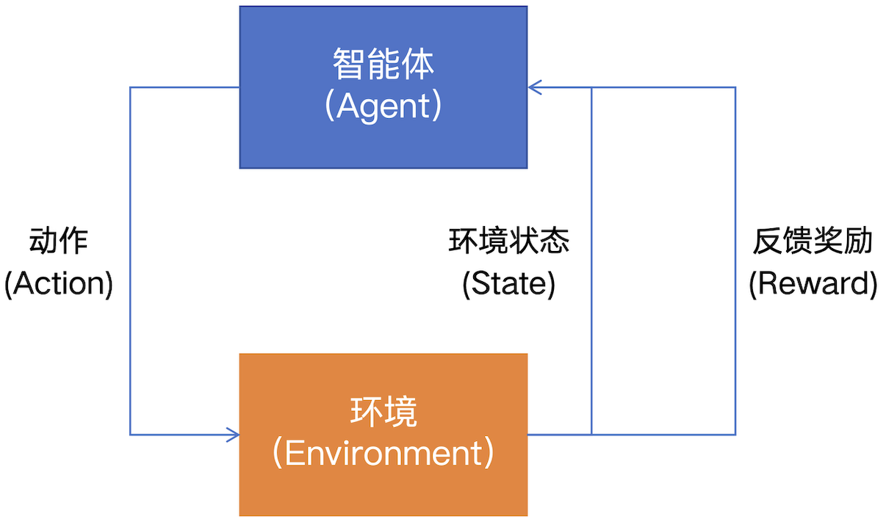
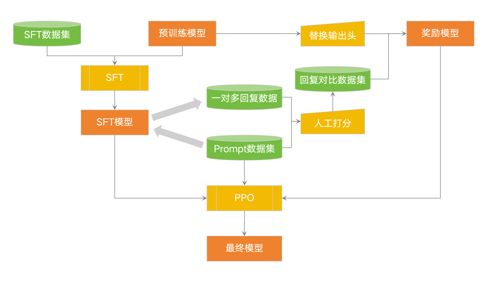
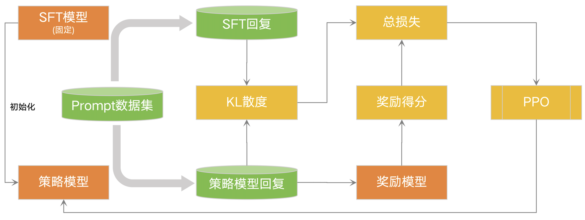
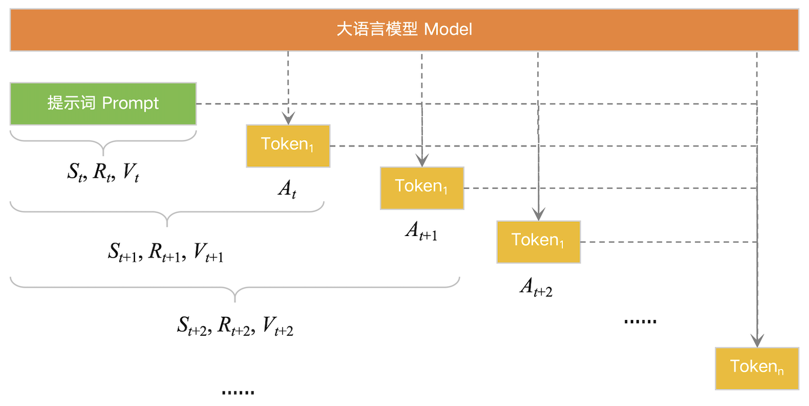
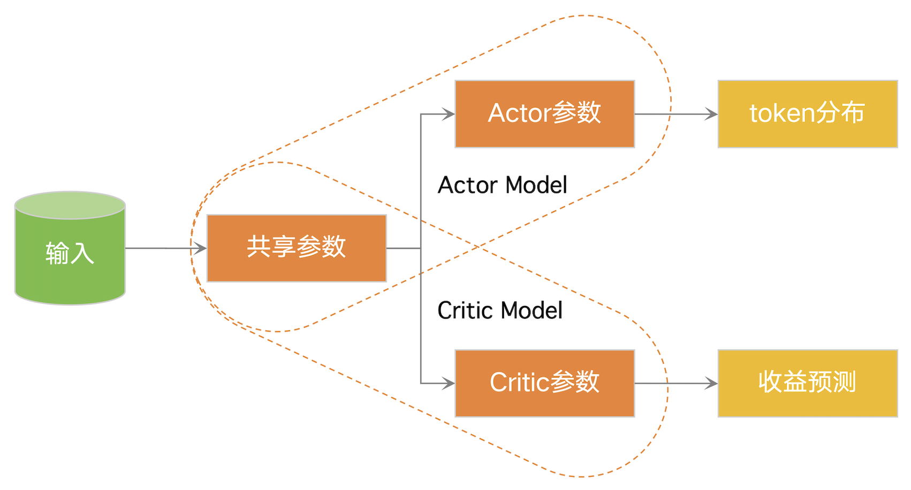
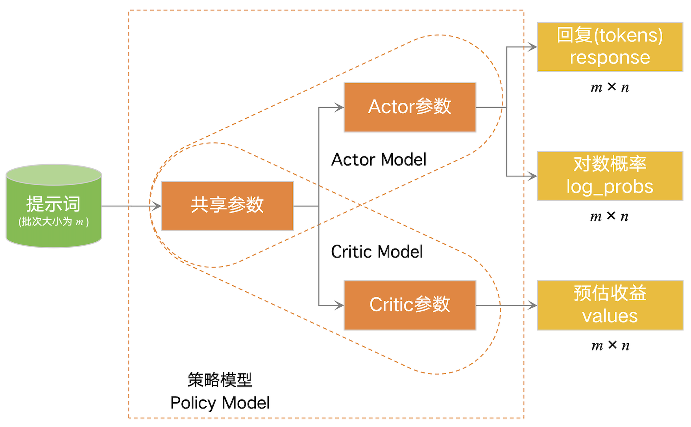
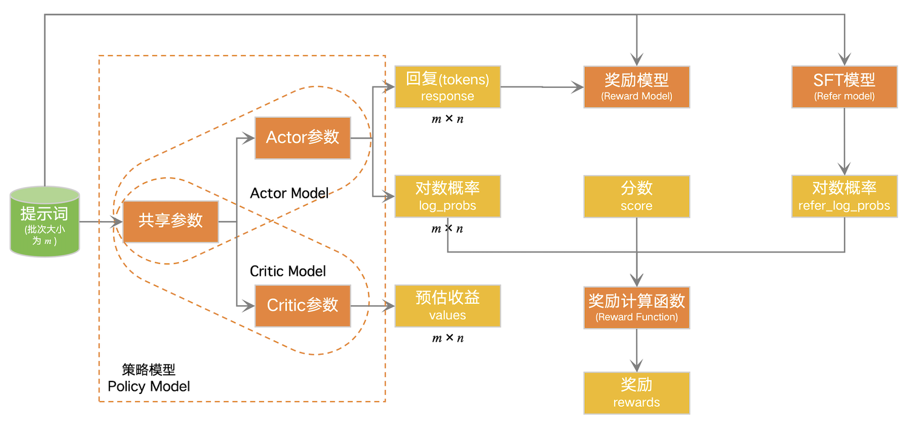

# 人类反馈强化学习(RLHF)

强化学习(Reinforcement Learning, RL)是机器学习的范式和方法论之一，是一种让智能体(Agent)与环境(Environment)交互过程中通过学习策略以达成回报最大化或实现特定目标的方法。强化学习有两个可以进行交互的对象：智能体和环境。

 - 智能体(Agent)：可以感知环境状态(State)，根据反馈奖励(Reward)选择合适动作(Action)最大化长期收益，在交互过程中进行学习。
 - 环境(Environment)：接受智能体执行的一系列动作，对这一系列动作进行评价并转换为一种可量化的信号，并最终反馈给智能体。

过去一段时间里，对 LLM 生成结果的评估是主观和依赖上下文的。例如，我们希望模型生成一个有创意的故事、一段真实的信息性文本，或者是可执行的代码片段，这些结果难以用现有的基于规则的文本生成指标 (如 BLUE 和 ROUGE) 来衡量。另外，现有的模型通常以预测下一个单词的方式和损失函数 (如交叉熵) 来建模，没有显式地引入人的偏好和主观意见。也就是说，LLM 的目标和行为与人类偏好之间存在偏差。

如何理解上面这段话呢？举一个简单的例子。假如我们要训练一个识别“猫”和“狗”的图像识别模型，使用对数损失(log loss)作为损失函数。比如我们经过两次实验性的训练，得到了两个模型——模型 A 和模型 B 。模型 A 和模型 B 的预测表现如下：

可以看到，模型 A 的总损失为 1.54，模型 B 的总损失为 2.50。因此，根据在损失函数上的表现，模型 A 的表现优于模型 B。但如果要看分类精度，那么模型 B 的分类精度为 100%，而模型 A 的分类精度为 75%。由此可见，我们想要的是分类精度最高的模型，但训练得到的缺可能是损失更小但分类精度不高的模型。

回到 LLM，我们同样面临这个问题。那些基于大量数据训练得到的 LLM，在实际使用中却往往表现出：

 - 对用户明确指示的遵循能力差(让干啥却不干)；
 - 输出虚构和错误的阐述(胡说八道)；
 - 语言通顺却违背理性逻辑(逻辑性差)；
 - 输出有害内容(违规)。

例如，如果用户输入“一只猫正在追逐”，LLM 可能会很流畅的输出“一只老鼠”，从而完成句子的补全。这对于天生用来预测句子下一个字的 LLM 来说，是一件理所当然的事情。但如果用户输入“写一个关于猫和老鼠的故事”。初始的 LLM 可能会难以理解这个问题。它可能会输出“是一个很好的主意。写作能锻炼人的思维能力和表达能力，并可以帮助我们打发无聊的周末时光...”。

这就需要我们对 LLM 进行改进，使其能够更好地理解和遵循用户指令，输出更符合用户预期的内容。这就引出了使用人类反馈来训练 LLM 的问题——RLHF。

## RLHF 流程

RLHF 包括 3 个主要步骤：

#### (1) 有监督微调，增强预训练模型的能力(SFT模型)

 - 选取一个预训练模型作为基座大模型，这个模型经过了自监督学习，可以进行文本生成任务。
 - 构建一个微调(SFT)数据集，这个数据集包含了质量较高的用户指令和对应模型输出，如：{"用户":"写一个关于猫和老鼠的故事", "LLM":"从前，有一只猫和一只老鼠..."}
 - 使用上述微调数据集对预训练模型进行微调，使得模型产生质量较好的回复。

#### (2) 构造回复对比数据集，训练奖励模型(Reward模型)

 - 收集同一个用户输入下的多个回复(可以来自于一个大语言模型或多个大语言模型)。
 - 人工对这些回复进行评分排序，得到一个回复对比数据集。
 - 基于回复对比数据集训练一个奖励模型(奖励模型的结构可以是多种多样的，但为了简单，一般情况下我们会在(1)中的预训练语言模型上加一个输出头，使其输出1维标量)。该模型能够对不同回复的好坏进行评分排序(输出一个标量结果)。

 #### (3) 基于奖励模型，使用强化学习算法进行微调

 - 对于一个新的用户输入，SFT模型会产生一个回复。
 - 奖励模型对这个回复进行评分。
 - 根据奖励模型评分优化SFT模型。
 - 重复上述步骤，直到SFT模型能够产生符合用户预期的回复。

RLHF 中的 (1) 和 (2) 相对简单、明确，而 (3) 则需要用到强化学习算法。所以，接下来我们重点介绍强化学习算法。

### RLHF 中的强化学习流程

如下图所示，RLHF 中的强化学习主要包括如下几个步骤：

    a. 初始化策略模型：直接使用SFT模型 (SFT Model) 作为初始的策略模型，并在后续步骤中，对策略模型进行更新。
    b. 将用户输入输入到SFT模型和策略模型中，分别得到SFT模型的回复和策略模型的回复。
    c. 计算SFT模型回复和策略模型的回复的差异，通常使用KL散度作为差异度量指标。
    d. 将策略模型的回复输入到奖励模型中，得到该回复的评分。
    e. 整合奖励模型的评分和KL散度，得到一个总损失。
    f. 使用总评分对策略模型进行更新，使得策略模型的回复更加符合用户预期。
    g. 重复上述步骤，直到策略模型优化完成。

因此，在 RLHF 的强化学习流程中，又以如何更新策略模型为重中之重。更新策略模型参数的最常见方法是近端策略优化(PPO)算法。

#### 强化学习回顾

强化学习中有 2 个的实体：**智能体(Agent)** 和 **环境(Environment)**。在大模型的强化学习中，这 2 个实体分别对应 **大模型** 和他产出的 **语料**。

强化学习智能体与环境的交互过程：
 - 在 $t$ 时刻，环境的状态为 $S_t$ ，这一状态下对应的收益为 $R_t$ ；
 - 智能体根据当前环境状态 $S_t$ 和收益 $R_t$ ，采取动作 $A_t$ ；
 - 环境根据智能体的动作 $A_t$ ，产生新的状态 $S_{t+1}$ 和对应的收益 $R_{t+1}$ 。

当然，在考虑奖励的时候，我们通常不仅局限于即时收益 $R_t$ ，而是考虑期望总收益 $V_t$ ：

$$V_t = R_t + \gamma V_{t+1}$$

其中， $V_t$ 是 $t$ 时刻的期望总收益， $R_t$ 是 $t$ 时刻的即时收益， $\gamma$ 是折扣因子， $V_{t+1}$ 是在 $t+1$ 时刻的期望总收益。

在大模型的强化学习中，我们可以这样理解强化学习过程(这里忽略下标 $t$ 不对齐的问题)：

 - 在 $t$ 时刻，将 1 个 prompt 作为“上文”初始状态 $S_t$ ，大模型根据“上文”生成 1 个 token，这个 token 即对应强化学习中的动作 $A_t$ ，对应的即时收益为 $R_t$ ，期望总收益为 $V_t$ ；
 - 更新环境状态，即“上文”更新为“上文+新生成的token” $S_{t+1}$ ；
 - 重复上述过程。

 

#### PPO

RLHF 中的 PPO 算法主要分为 3 个部分：**采样、反馈和学习**。它们的逐一迭代执行，构成了 PPO 算法的基本流程：

 - 初始化一个待优化的策略模型(Policy Model)。
 - 重复以下步骤，直到满足停止条件：
     - **采样**：从Prompt数据集中采样提示词，输入到策略模型中，得到策略模型的回复。
     - **反馈**：将策略模型的回复输入到奖励模型(Reward Model)中，并综合计算奖励。
     - **学习**：根据提示词、回复和奖励优化策略模型。

在这个过程中，一共涉及 4 个模型：
 - Actor Model：待训练的目标语言模型，使用 SFT 模型进行初始化；
 - Critic Model：作用是预估期望总收益 $V_t$，它与 Reward Model 的分工不同( Reward Model 只负责给最后一个 token 或者说这个句子打分，而给之前的每个 token 打分需要 Critic Model)；
 - Reward Model：作用是计算即时收益 $R_t$；
 - Refer Model：即是 SFT 模型，作用是给训练增加一定的约束，防止 Actor Model 在训练过程中走偏。

其中，Actor Model 和 Critic Model 是要在 RKHF 过程中接受训练的；Reward Model 和 Refer Model 是不参与训练的；而 Critic Model、Reward Model 和 Refer Model 3 个模型组成了一个针对 Actor Model 的收益(或损失)评估系统。

##### (1) 采样

采样即是模型根据提示词生成回复的过程。例如：

 - 提示词：早饭、午饭和晚饭哪一个最重要？
 回复：早饭最重要，因为它是新的一天开始的标志。
 - 提示词：牛肉和鸡肉哪一个的蛋白质含量更高？
 回复：这个问题很难回答，因为这取决于牛和鸡的种类以及取自哪个部位。
 - 提示词：西兰花和猪肉一起炒有毒吗？
 回复：没有科学证据表明将西兰花和猪肉一起炒会产生有毒物质。

PPO 算法在采样过程中首先构建了一个策略模型(Policy Model)，它由两个模型组成：Actor Model 和 Critic Model。Actor Model 即是 RLHF 前期训练得到的 SFT model，负责根据提示词生成回复；而 Critic Model 通常可以将 Actor Model 的最后1层替换为一个新的全连接层(将结果映射成 1 维标量 $V_t$ )，除了这一层，Critic Model 和 Actor Model 的其他层是共享的 (也有不共享参数的架构，比如使用Reward模型初始化)，负责评估收益 (输入一段上下文，它将输出下一个 token 的“收益")。

为什么要单独构建一个 Critic Model 呢？因为我们在 $V_t$ 的实际计算过程中，在 $t$ 时刻，并没有获取到 $V_t$ 的实际值，因为 $V_{t+1}$ 此时并未真正的输出，只能通过训练一个 Critic Model 去估计它。

当批量大小为 $m$ 的提示词输入到策略模型中时，将产生 3 种类型的输出：

 - 回复(response): Actor Model 输出的批次大小为 $m$ 的回复，每个回复为包含 $n$ 个 token 的序列。
 - 对数概率(log_probs)：Actor Model 输出的回复 token 对应的对数概率 $log(p)$ ，是一个形状为 $m \times n$ 的张量。
 - 预估收益(values): Critic Model 输出的形状为 $m \times n$ 的张量，包含了每次生成 token 时评论家预估的收益。

至此，PPO 算法已经完成了采样阶段，该阶段的 3 个输出将作为后续计算的输入。

##### 反馈

反馈是奖励模型(Reward Model)对采样的回复进行评分的过程。例如，对如下提示词和回复，奖励模型将给出一个分数：
 - 提示词：西兰花和猪肉一起炒有毒吗？
 回复：没有科学证据表明将西兰花和猪肉一起炒会产生有毒物质。
 评分：1.0
 - 提示词：西兰花和猪肉一起炒有毒吗？
 回复：西兰花和猪肉一起炒是否有毒需要根据实验结果才能确定。
 评分：0.6
 - 提示词：西兰花和猪肉一起炒有毒吗？
 回复：西兰花和猪肉一起炒会产生大量有毒物质，食用后会导致人神经麻痹。
 评分：0.0

这里我们可以注意到一点，Critic Model 和 Reward Model 都具有对回复进行评分的作用，那他们之间有什么关系或者是该如何配合呢？首先，我们要明确一点，Critic Model 输出的预估收益 $V_t$ 是一个预测结果(前提假设是 $A_t$ 还未产生)，但在此时，我们已经明确知道模型在 $t$ 时刻生成的 token $A_t$ ，因此，我们可以使用 Reward Model 计算模型在 $t$ 时刻生成的 token $A_t$ 的真实奖励 $R_t$，并使用 $R_t$ 和预估收益 $V_{t+1}$ 之和来计算 $V_t$ ，即 $V_t = R_t + \gamma V_{t+1}$。这显然比直接使用 Critic Model 直接输出的预估收益 $V_t$ 更合理。

但反馈并不仅包含 Reward Model 的评分结果。因为，Reward Model 的评分结果只是衡量了最终回复(response)的好坏，而没有考虑到过程是否合理、是否与SFT模型相差过大。即我们希望 Actor Model 输出的对数概率(log_probs)和 SFT 模型(这里被称为 Refer Model)输出的对数概率(refer_log_probs)之间的差异越小越好。因此，在反馈阶段，我们会将奖励模型输出的分数(score)、Actor Model 输出的对数概率(log_probs)和 Refer Model 输出的对数概率(refer_log_probs)输入到一个奖励计算函数(Reward Function)中，得到最终的奖励(rewards)。

在实际计算过程中，可以使用 KL 散度的近似计算版本(参见http://joschu.net/blog/kl-approx.html)作为衡量 Actor Model 输出和 Refer Model 输出的差异的指标。例如，其 k1 近似计算版本计算公式如下：

$$KL = log\_probs - refer\_log\_probs$$

即 Actor Model 输出的对数概率(log_probs)和 Refer Model 输出的对数概率(refer_log_probs)之差。KL 散度的计算结果将被作为后续损失函数的一部分。

##### 学习

学习过程是一个强化优势动作(根据反馈改进模型)的过程，其核心是损失函数的设计。因为 PPO 算法涉及 2 个要训练的模型：Actor Model 和 Critic Model，所以 PPO 算法的损失函数也分为 2 部分：Actor Loss 和 Critic Loss。

(1) Actor Loss

为方便理解，我们通过一步步地增加考虑的因素和复杂度得到最终的 Actor Loss。

(i) 首先，我们考虑最简单的情况。

Actor Model 接受一个输入 $S_t$ 并产出输出 token $A_t$；Critic Model 根据 $S_t$ 和 $A_t$ 产出对总收益的预估 $Vt$ 。此时，Actor Loss 可以写为： $Actor\_Loss = -\sum_{t \in response\_time} V_t \log P(A_t|S_t)$ 。即对于回复的每个 token (不含Prompt)，使用它对应的预估收益 $V_t$ 乘以该 token 的对数概率 $log(P(A_t|S_t))$ ，并对所有 token 的损失求和。当 $V_t > 0$ 时，即该 token 对应的预估收益为正，则希望在训练中提高 $A_t$ 的产出概率 $P(A_t|S_t)$ ，从而减小 Actor Loss；当 $V_t < 0$ 时，即该 token 对应的预估收益为负，则希望在训练中降低 $A_t$ 的产出概率 $P(A_t|S_t)$ ，从而减小 Actor Loss。

(ii) 接下来，引入优势。

如果 Critic Model 根据 $S_t$ 和 $A_t$ 对总收益的预估为 $Vt$ ，而实际的总收益(前面提及的)为 $R_t + \gamma V_{t+1}$ ，那么优势就可以定义为 $ADV_t = R_t + \gamma V_{t+1} - V_t$ 。此时，使用 $ADV_t$ 代替 $V_t$ ，Actor Loss 可以写为： $Actor\_Loss = -\sum_{t \in response\_time} ADV_t \log P(A_t|S_t)$ 。即，如果生成 token 对应的 $A_t$ 实际收益比预估收益高，即 $ADV_t > 0$ ，则希望在训练中提高  $A_t$ 的产出概率 $P(A_t|S_t)$ ，从而减小 Actor Loss；如果生成 token 对应的 $A_t$ 实际收益比预估收益低，即 $ADV_t < 0$ ，则希望在训练中降低 $A_t$ 的产出概率 $P(A_t|S_t)$ ，从而减小 Actor Loss。 

(iii) 然后，重塑 $R_t$ 。

按照之前的理解， $R_t$ 是对应于每个 $S_t$ 和 $A_t$ 的即时收益。但在实际应用中(如在 deepspeed-chat 中)，我们可以将 $R_t$ 重塑为：

$$R_t = -kl\_ctl \times \left[ \log \frac{P(A_t|S_t)}{P\_ref(A_t|S_t)} \right], \text{when  } t \ne n.$$

$$R_t = -kl\_ctl \times \left[ \log \frac{P(A_t|S_t)}{P\_ref(A_t|S_t)} \right] + R_t, \text{when  } t = n.$$

其中， $kl\_ctl$ 是一个控制缩放比例的常参数，在 deepspeed-chat 中默认设置为 0.1； $-\log \frac{P(A_t|S_t)}{P\_ref(A_t|S_t)}$ 即 KL 散度的近似(可写为 $log\_probs - refer\_log\_probs$ )。注意：后一个等式左右两侧的 $R_t$ 含义不同。

上面重塑之后的 $R_t$ ，可以理解为：在 $t \ne n$ 时，我们只关心 Actor Model 生成的 token 的对数概率是否过度偏离 Refer Model；在 $t = n$ 时，我们不仅关心 Actor Model 生成的 token 的对数概率是否过度偏离 Refer Model，还关心整个回复的真实即使收益 $R_t$。

此时，Actor Loss 可以写为： 
 
$$Actor\_Loss = -\sum_{t \in response\_time} ADV_t \log P(A_t|S_t)$$

其中，

$$ADV_t = R_t + \gamma V_{t+1} - V_t$$

$$R_t = -kl\_ctl \times \left[ \log \frac{P(A_t|S_t)}{P\_ref(A_t|S_t)} \right], \text{when  } t \ne n.$$

$$R_t = -kl\_ctl \times \left[ \log \frac{P(A_t|S_t)}{P\_ref(A_t|S_t)} \right] + R_t, \text{when  } t = n.$$

(iv) 进一步，重塑 $ADV_t$ 。

在的预估收益的计算中，我们使用 $t+1$ 时刻的预估收益 $V_{t+1}$ 和 $t$ 时刻的即时收益 $R_t$ 来计算 $t$ 时刻的预估收益 $V_t$。那优势的计算是否可以引入此方法呢？显然是可以的。我们可以将 $ADV_t$ 的计算公式由

$$ADV_t = R_t + \gamma V_{t+1} - V_t$$

重塑为：

$$ADV_t = (R_t + \gamma V_{t+1} - V_t) + \gamma \cdot \lambda \cdot ADV_{t+1}$$

其中， $\lambda$ 是一个常量，直观上是对未来优势折算到当前的系数，而从强化学习的角度来说，它调整了优势估计的方差和偏差。

关于未来的优势 $ADV_{t+1}$ 的计算问题，我们可以从 $t = n$ 即最后的时刻开始向前计算。对于 $t = n$ 的时刻，未来收益 $V_{n+1}$ 和 未来优势 $DEV_{n+1}$ 都是 0，所以：

$$ADV_n = R_n - V_n$$

进而对于 $t < n$ 的时刻，我们可以递归地计算：

$$ADV_{n-1} = (R_{n-1} + \gamma V_{n} - V_{n-1}) + \gamma \cdot \lambda \cdot ADV_{n}$$

$$ADV_{n-2} = (R_{n-2} + \gamma V_{n-1} - V_{n-2}) + \gamma \cdot \lambda \cdot ADV_{n-1}$$

...

$$ADV_t = (R_t + \gamma V_{t+1} - V_t) + \gamma \cdot \lambda \cdot ADV_{t+1}$$

(v) 继而，引入新的约束。

截止目前 Actor Loss 可以写为： 
 
$$Actor\_Loss = -\sum_{t \in response\_time} ADV_t \log P(A_t|S_t)$$

其中，

$$ADV_t = (R_t + \gamma V_{t+1} - V_t) + \gamma \cdot \lambda \cdot ADV_{t+1}$$

$$R_t = -kl\_ctl \times \left[ \log \frac{P(A_t|S_t)}{P\_ref(A_t|S_t)} \right], \text{when  } t \ne n.$$

$$R_t = -kl\_ctl \times \left[ \log \frac{P(A_t|S_t)}{P\_ref(A_t|S_t)} \right] + R_t, \text{when  } t = n.$$

在 RLHF 中，每个 batch 的输入数据都需要经过 4 个模型的推理计算，这是一个非常耗时、耗资源的操作。如果一个数据 batch 如果全部计算完成只更新 1 次 Actor Model 和 Critic Model，那似乎有点而太浪费了。因此，我们可以引入一个新的迭代更新策略，针对每个 batch 的数据，我们迭代计算 ppo-epochs 次 Actor Model 和 Critic Model，同时迭代更新 ppo-epochs 次 Actor Model 和 Critic Model：

 - 对于每个 batch 的数据，将其输入到 Actor Model 、 Critic Model 、 Reward Model 和 Refer Model中，得到相应的输出；
 - 迭代计算 ppo-epochs 次 Actor Loss 和 Critic Loss， 并更新 Actor Model 和 Critic Model：
    - 将 4 个模型的输出输入到 Actor Loss 和 Critic Loss 计算函数之中，得到相应的损失；
    - 根据计算的损失，反向传播计算梯度，并更新 Actor Model 和 Critic Model。

从上述迭代过程可以看出，每个 batch 的输入数据被使用 ppo-epochs 次进行参数更新，这会不会导致更新过大的问题？尤其是当优势 $ADV_t$ 很大的时候。为避免这种情况，我们进一步改造损失函数 Actor Loss，引入一个新的约束：

$$Actor\_Loss = -\sum_{t \in response\_time} ADV_t \log \frac{P(A_t|S_t)}{P_{origin}(A_t|S_t)}$$

其中， $P_{origin}(A_t|S_t)$ 是 ppo-epochs 次更新前获取并处理数据的那个 Actor Model 输出的对数概率； $P(A_t|S_t)$ 是每次更新后的 Actor Model 输出的对数概率。所以，针对 ppo-epochs 次更新， $P_{origin}(A_t|S_t)$ 实际上是一个常量。其作用相当于对学习率的一个调整，不要让 $P(A_t|S_t)$ 偏离 $P_{origin}(A_t|S_t)$ 太大。

上述是一个直观的解释。这里实际上涉及“重要性采样”的概念，使用 $P_{origin}(A_t|S_t)$ 去辅助模拟每次更新之后的 $P(A_t|S_t)$ 的分布(即 Actor Model 与环境的交互过程)。这一处理方式解决了 Actor Model 更新过过程中的交互问题，但也同时新的问题，如果 $\frac{P(A_t|S_t)}{P_{origin}(A_t|S_t)}$ 波动过大，则最终的结果可能会有很大的方差，导致结果不可靠。所以 PPO 算法中引入了“剪裁机制”来解决这个问题。

在介绍“剪裁机制”之前，我们先对 Actor Loss 做进一步的变换，将其使用一阶泰勒展开式( $\log(x) \simeq x-1$ 在损失函数中，常数项 1 通常进一步被忽略)进行近似：

$$Actor\_Loss = -\sum_{t \in response\_time} ADV_t \log \frac{P(A_t|S_t)}{P_{origin}(A_t|S_t)} \simeq -\sum_{t \in response\_time} ADV_t \frac{P(A_t|S_t)}{P_{origin}(A_t|S_t)}$$

因此，Actor Loss 现在可以写为： 
 
$$Actor\_Loss = -\sum_{t \in response\_time} ADV_t \frac{P(A_t|S_t)}{P_{origin}(A_t|S_t)}$$

其中，

$$ADV_t = (R_t + \gamma V_{t+1} - V_t) + \gamma \cdot \lambda \cdot ADV_{t+1}$$

$$R_t = -kl\_ctl \times \left[ \log \frac{P(A_t|S_t)}{P\_ref(A_t|S_t)} \right], \text{when  } t \ne n.$$

$$R_t = -kl\_ctl \times \left[ \log \frac{P(A_t|S_t)}{P\_ref(A_t|S_t)} \right] + R_t, \text{when  } t = n.$$

(vi) 最后，剪裁机制

为避免 $\frac{P(A_t|S_t)}{P_{origin}(A_t|S_t)}$ 波动过大，为其设置一个范围，如 0.8~1.2之间：

$$Actor\_Loss = -\sum_{t \in response\_time} \min \{ ADV_t \frac{P(A_t|S_t)}{P_{origin}(A_t|S_t)}, ADV_t \cdot \text{clip} (\frac{P(A_t|S_t)}{P_{origin}(A_t|S_t)}, 0.8, 1.2) \}$$

其中， $\text{clip} (\frac{P(A_t|S_t)}{P_{origin}(A_t|S_t)}, 0.8, 1.2)$ ，将 $\frac{P(A_t|S_t)}{P_{origin}(A_t|S_t)}$ 的值限制在 0.8~1.2 之间。

那既然已经使用剪裁函数 clip 限制了 $\frac{P(A_t|S_t)}{P_{origin}(A_t|S_t)}$ 的范围，为什么还需要使用 min 函数取最小呢？因为 min 函数的作用是确保优化器只向安全的方向上更新：

 - 当 $ADV_t > 0$ 时，当前动作的实际收益比预估收益高：此时我们希望提高该动作的概率，也就是让 $\frac{P(A_t|S_t)}{P_{origin}(A_t|S_t)} > 1.0$ 。
   - 如果 $\frac{P(A_t|S_t)}{P_{origin}(A_t|S_t)} \in [0.8, 1.2]$ ，说明变化不大，保留原始梯度；
   - 如果 $\frac{P(A_t|S_t)}{P_{origin}(A_t|S_t)} > 1.2$ ，说明更新策略过大，使用 1.2 代替它；
   - 如果 $\frac{P(A_t|S_t)}{P_{origin}(A_t|S_t)} < 0.8$ ，说明策略发生退化(反而降低了该动作概率)，这时候使用 0.8 代替它。但因为 $\frac{P(A_t|S_t)}{P_{origin}(A_t|S_t)} < 0.8$ 且 $ADV_t > 0$ ，所以求 min 运算之后，仍会使用 $ADV_t \frac{P(A_t|S_t)}{P_{origin}(A_t|S_t)}$ ，即 clip 不起作用。这种处理方式产生的结果是：当策略变差时，PPO 不会强制拉回，而是允许梯度继续反向传播去修正策略。
 - 当 $ADV_t < 0$ 时，当前动作的实际收益比预估收益低：此时我们希望降低该动作的概率，也就是让 $\frac{P(A_t|S_t)}{P_{origin}(A_t|S_t)} < 1$ 。
   - 如果 $\frac{P(A_t|S_t)}{P_{origin}(A_t|S_t)} \in [0.8, 1.2]$ ，说明变化不大，保留原始梯度；
   - 如果 $\frac{P(A_t|S_t)}{P_{origin}(A_t|S_t)} > 1.2$ ，说明策略发生退化(反而提高了该动作的概率)，这时候使用 1.2 代替它。但因为此时 $ADV_t < 0$ ，求 min 运算之后，仍会使用 $ADV_t \frac{P(A_t|S_t)}{P_{origin}(A_t|S_t)}$ ，即 clip 不起作用。这种处理方式产生的结果是：当策略变差时，PPO 不会强制拉回，而是允许梯度继续反向传播去修正策略；
   - 如果 $\frac{P(A_t|S_t)}{P_{origin}(A_t|S_t)} < 0.8$ ，说明策略更新过大(概率降的太低了)，这时候使用 0.8 代替它。

因此，剪裁实际上并不总是起作用，它只是在某些某些情况下其他保护作用，如防止降低概率过多。

(vii) Actor Loss 总结

基于上述步骤，我们最终建立起了一个损失函数：

$$Actor\_Loss = -\sum_{t \in response\_time} \min \{ ADV_t \frac{P(A_t|S_t)}{P_{origin}(A_t|S_t)}, ADV_t \cdot \text{clip} (\frac{P(A_t|S_t)}{P_{origin}(A_t|S_t)}, 0.8, 1.2) \}$$

其中，

$$ADV_t = (R_t + \gamma V_{t+1} - V_t) + \gamma \cdot \lambda \cdot ADV_{t+1}$$

$$R_t = -kl\_ctl \times \left[ \log \frac{P(A_t|S_t)}{P\_ref(A_t|S_t)} \right], \text{when  } t \ne n.$$

$$R_t = -kl\_ctl \times \left[ \log \frac{P(A_t|S_t)}{P\_ref(A_t|S_t)} \right] + R_t, \text{when  } t = n.$$

从最初的状态，我们对这个损失函数进行了如下的优化：

 - 对 $R_t$ 进行了优化，使其能够衡量 Actor Model 是否遵循了 Refer Model 的约束；
 - 对 $ADV_t$ 进行了优化，使其综合考虑了当前和未来的优势；
 - 利用 1 个 batch 的数据进行 ppo_epochs 次模型更新；
 - 使用了“剪裁机制”控制模型参数更新的幅度。

(2) Critic Loss

除了 Actor Model，我们还需要更新 Critic Model，所以也需要构建一个损失函数 Critic Loss ：

$$Critic\_Loss = \sum_{t \in response\_time} [V_t - (R_t + \gamma V_{t+1})]^2$$

其中， $V_t$ 表示 Critic Model 在 t 时刻的总收益预估(包括即使收益和未来收益)； $R_t + \gamma V_{t+1}$ 是 Reward Model 计算出的即时收益 $R_t$ 和 Critic Model 预估的未来收益 $V_{t+1}$ 之和，是一个比 $V_t$ 更接近 $t$ 时刻真实收益的值。当然，也可以使用“优势”和“剪裁”等对这个损失函数进行进一步的优化。

(2) Total Loss

在实际实现过程中， Actor Loss 和 Critic Loss 通常被加权合并到一起作为一个整体的损失函数进行优化:

$$Total\_Loss = Actor\_Loss + w_c \cdot Critic\_Loss$$

这样做的目的主要有：

 - 简化训练过程，可以在一次前向传播和反向传播过程中同时更新策略网络(Actor Model)和价值网络(Critic Model)，提高计算效率;
 - 灵活调整重要性，通过调整 $w_c$ 的值可以控制策略学习和价值学习之间的平衡(如果环境的状态值函数相对容易学习或者不那么重要，可以选择较小的 $w_c$ ；反之，如果需要更精确的价值函数估计(比如在高方差环境中)，则可能需要选择较大的 $w_c$ ​)。

### DPO

DPO (Direct Preference Optimization，直接偏好优化) 是一种专为大语言模型(LLMs)设计的训练方法，旨在使用人类偏好数据优化模型，而无需使用复杂的强化学习方法(如PPO)。DPO的特点主要有：

 - 使用最大似然估计来优化策略；
 - 不需要奖励模型也能学习出与人类偏好一致的最有策略；
 - 与 RLHF 相比，DPO 训练更加稳定和简化，且性能与之相当。

在详细介绍 DPO 之前，我们先了解一下几个概念。

 - KL 散度。KL 散度已经在前面反复多次提及，它在 DPO 中主要用于限制模型的训练，即最小化模型与参考模型之间的 KL 散度，确保当前模型不会偏离参考模型太远，从而保持模型的稳定性。
 - Bradley-Terry 模型。Bradley-Terry 模型是一种统计模型，用于预测两个对象之间的胜负概率。在 DPO 中，它被用来估计人类偏好数据中一对对话的胜率。Bradley-Terry 模型的核心假设是对每个对象 $O_i$ 都对应有一个潜在的“强度”参数 $\lambda_i$ 用于刻画对象 $O_i$ 的“强度”。对于任意两个对象 $O_i$ 和 $O_j$ ， $O_i$ 对 $O_j$ 的胜率 $P(i > j)$ 可以表示为：

 $$P(i > j) = \frac{\lambda_i}{\lambda_i + \lambda_j}$$

 - 最大似然估计。最大似然估计是一种常用的参数估计方法，用于估计模型参数。在 DPO 中，它被用来估计人类偏好数据中一对对话的胜率。以上面 Bradley-Terry 模型中的“强度”参数为例，$x_{i,j}$ 是指示变量，$x_{i,j} = 1$ 表示 $O_i$ 胜过 $O_j$ ，待估参数是 $\lambda$ ，则似然函数是：

 $$L(\lambda) = \prod_{i,j \in N} \left( \frac{\lambda_i}{\lambda_i + \lambda_j}\right)^{x_{i,j}} \left(\frac{\lambda_j}{\lambda_i + \lambda_j}\right)^{1-x_{i,j}}$$

#### DPO 优化目标

##### 奖励模型损失

假设 $y_w$ 、 $y_l$ 分别是人类偏好中的“优选”和“次优选”，根据 Bradley-Terry 模型，我们可以得到 $y_w$ 优于 $y_l$ 的概率为：

$$P(y_w > y_l) = \frac{\lambda_w}{\lambda_w + \lambda_l}$$

那这里的 $\lambda_w$ 和 $\lambda_l$ 是什么？在 DPO 中，它们是奖励模型的分数 $r(x, y)$ 。进一步考虑到 $r(x, y)$ 可能为负数，因此使用其指数形式 $e^{r(x, y)}$ 来代替。所以，上式可以改写为：

$$P(y_w > y_l | x) = \frac{e^{r(x, y_w)}}{e^{r(x, y_w)} + e^{r(x, y_l)}} = \sigma(r(x, y_w) - r(x, y_l))$$

其中， $\sigma(z) = \frac{1}{1 + e^{-z}}$ 是 logistic 函数。

对人类偏好数据集 $D = \{x^{(i)}, y_w^{(i)}, y_l^{(i)}\}_{i=1}^N$ ，其似然函数为：

$$L(r, D) = \prod_{(x, y_w, y_l) \sim D} \sigma(r(x, y_w) - r(x, y_l))$$

对似然函数两边取对数、负数并除以样本数(均值转换)，可以得到似然损失函数：

$$L_R(r_{\phi}, D) = -E_{(x, y_w, y_l) \sim D}[\log \sigma(r_{\phi}(x, y_w) - r_{\phi}(x, y_l))]$$

其中， $r_{\phi}$ 是隐式奖励模型。

## 优化目标

目标函数可写为：

$$\max_{\pi_{\theta}} E_{x \sim D, y \sim \pi_{\theta}(y|x)}\left[ r_{\phi}(x, y)\right] - \beta D_{KL} \left[ \pi_{\theta}(y|x) || \pi_{ref}(y|x) \right] $$

其中， $D = \{x^{(i)}, y_w^{(i)}, y_l^{(i)}\}_{i=1}^N$ 表示人类偏好数据集； $\pi_{\theta}(y|x)$ 表示当前策略模型的输出分布； $\pi_{ref}(y|x)$ 表示参考策略模型的输出分布； $r_{\phi}(x, y)$ 表示隐式奖励模型输出； $\beta$ 是一个超参数，用于控制KL散度损失对目标函数的影响程度。

上式可以这样理解：

 - $x \sim D, y \sim \pi_{\theta(y|x)}$ ：对于一个策略 $\pi_{\theta}$ 对应的动作输入 $x$ 和输出 $y$ ， $x$ 来自样本数据集 $D$ ， $y$ 遵行概率分布 $\pi_{\theta}$ 。
 - $\max_{\pi_{\theta}} E_{x \sim D, y \sim \pi_{\theta}(y|x)}\left[ r_{\phi}(x, y)\right]$ ：找到一个策略 $\pi_{\theta}$ 使得最终得分期望最高。
 - $- \beta D_{KL} \left[ \pi_{\theta}(y|x) || \pi_{ref}(y|x) \right]$ ：通过KL散度衡量策略 $\pi_{\theta}$ 与参考策略 $\pi_{ref}$ 的偏离程度，并通过乘以负数来惩罚两者之间的差异。

上式可以进一步转换为：

$$\max_{\pi_{\theta}} E_{x \sim D, y \sim \pi_{\theta}(y|x)}\left[ r_{\phi}(x, y)\right] - \beta D_{KL} \left[ \pi_{\theta}(y|x) || \pi_{ref}(y|x) \right] = \min_{\pi_{\theta}} E_{x \sim D} E_{y \sim \pi_{\theta}(y|x)} \left[ \log \frac{\pi_{\theta} (y|x)}{\frac{1}{Z(x)} \pi_{ref}(y|x)e^{\frac{1}{\beta}r_{\phi}(x,y)}} - \log Z(x) \right]$$

其中，

$$Z(x) = \sum_{y} \pi_{ref}(y|x) e^{\frac{1}{\beta}r_{\phi}(x,y)}$$

进一步定义：

$$\pi^{*}(y|x) = \frac{1}{Z(x)} \pi_{ref}(y|x)e^{\frac{1}{\beta}r_{\phi}(x,y)}$$

由于 $Z(x)$ 与 $\pi$ 无关，所以上式可进一步转换为：

$$\min_{\pi_{\theta}} E_{x \sim D} E_{y \sim \pi_{\theta}(y|x)} \left[ \log \frac{\pi_{\theta} (y|x)}{\frac{1}{Z(x)} \pi_{ref}(y|x)e^{\frac{1}{\beta}r_{\phi}(x,y)}} - \log Z(x) \right] = \min_{\pi} E_{x \sim D} \left[ D_{KL}(\pi(y|x)||\pi^{*}(y|x)) - \log Z(x) \right]$$

对于 KL 散度部分，当且仅当：

$$\pi_{\theta}(y|x) = \pi^{*}(y|x) = \frac{1}{Z(x)} \pi_{ref}(y|x)e^{\frac{1}{\beta}r_{\phi}(x,y)}$$

时取最小值。

## 损失函数

根据上面 DPO 的优化目标可知：

$$\pi_{\theta}(y|x) = \frac{1}{Z(x)} \pi_{ref}(y|x)e^{\frac{1}{\beta}r_{\phi}(x,y)}$$

变换后得到：

$$r_{\phi}(x,y) = \beta \log \frac{\pi_{\theta}(y|x)}{\pi_{ref}(y|x)} + \beta \log Z(x)$$

根据 Bradley-Terry 模型， $y_{w}$ 优于 $y_{l}$ 的概率为：

$$P(y_w > y_l | x) = \frac{1}{1+e^{r_{\phi}(x,y_l) - r_{\phi}(x,y_w)}} = \frac{1}{1+e^{\beta \log \frac{\pi_{\theta}(y_l|x)}{\pi_{ref}(y_l|x)} - \beta \log \frac{\pi_{\theta}(y_w|x)}{\pi_{ref}(y_w|x)}}}$$

因此模型损失函数为：

$$L_{DPO}(\pi_{\theta}; \pi_{ref}) = -E_{(x, y_w, y_l) \sim D} \left[ \log \sigma \left( \beta \log \frac{\pi_{\theta}(y_w|x)}{\pi_{ref}(y_w|x)} - \beta \log \frac{\pi_{\theta}(y_l|x)}{\pi_{ref}(y_l|x)} \right)\right]$$

其中， $\pi_{\theta}(y|x)$ 是当前策略模型的输出分布； $\pi_{ref}(y|x)$ 是参考策略模型的输出分布。通过该损失函数，模型优化胜出输出的生成概率，并减少劣势输出的输出概率。

## 主要流程

DPO 一般包括两步：

 - 构建偏好数据集 $D$ 。对于每一个 prompt $x$ ，生成一组候选回复 $y_w, y_l \sim \pi_{ref}(\cdot|x)$ 并标注人类偏好(也可以直接使用公开的皮那好数据集)，得到 $D = \{x^{(i)}, y_w^{(i)}, y_l^{(i)}\}_{i=1}^N$ 。
 - 给定参考模型  $\pi_{ref}$ 和人类偏好数据集 $D$，优化策略模型 $\pi_{\theta}$ ，使得损失函数 $L_{DPO}$ 最小。
