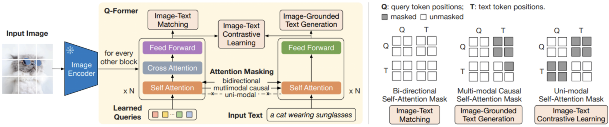
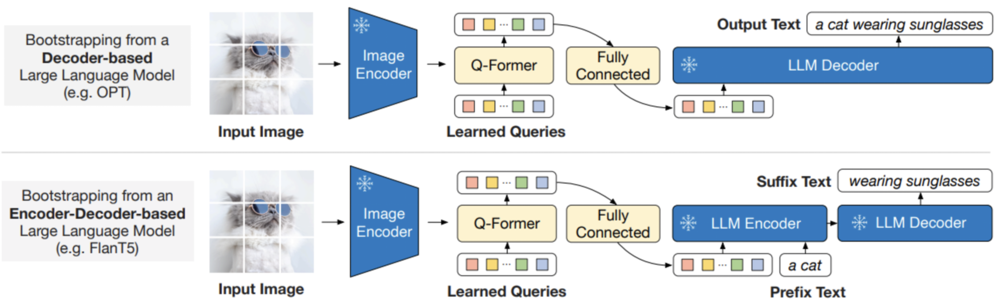

# Q-Former

Q-Former 是一个用于多模态大模型的框架，在介绍它之前，我们先回顾一下多模态大模型遇到的问题。

## 多模态大模型遇到的挑战

 - 模态鸿沟：图像和文本的语义空间差异太大，靠简单的对齐远远填不平这个“鸿沟”。
 - 计算量巨大：多模态大模型参数量基本过亿，高分辨率的图片扔进Vision Transformer(ViT)后输出的特征向量动辄几百上千维，再加上文本的Transformer处理，计算量巨大。尤其是预训练阶段，还需要海量数据进行训练，成本非常高。
 - 信息冗余：图片中存在大量无用的信息，比如背景、边框等，但文本任务往往只需要其中的一小部分，其他信息对模型训练和性能影响很大。

## Q-Former 框架

Q-Former 的核心思想是：通过一组可学习的 Query Embeddings 来提取图像关键特征，从而减少下游计算量和信息冗余，提升了模型效率和精度。

### 整体架构

Q-Former (Querying Transformer) 是 BLIP-2 (Bootstrapping Language-Image Pre-training with Frozen Image Encoders and Large Language Models) 的核心组件，我们先了解一下 BLIP-2 的整体架构。BLIP-2 有三个主要组成部分：

 - 图像编码器(Image Encoder)：将输入的图像转换为特征向量。通常使用的是预训练的 Vision Transformer (ViT)。图像编码器的参数是冻结的，不参与训练。
 - Q-Former：处于图像和文本之间，负责从图像特征中提取关键信息，并转换成语言模型可以使用的表示形式。
 - 语言模型(Language Model)：处理文本输入，并生成对应的输出。通常使用的是预训练的 GPT 或 BERT 模型。语言模型的参数也是冻结的，不参与训练。

BILP-2 的预训练主要包括两步：(1)固定图像编码器，进行视觉和语言的表征学习；固定语言模型模型，学习从图像生成文本。可以看出，图像编码器和语言模型的参数都是冻结的，只有 Q-Former 的参数是可学习的。而 Q-Former 的作用就是从图像编码器输出的特征(比如196个patch的向量)中提取出关键信息，然后传给语言模型。

那么，Q-Former 又是如何实现该功能的呢？

### Q-Former 详解

Q-Former 是由两个 Transformer 子模块组成的，其中的 Self Attention 在两个子模块中是共享的，也就是说 Self Attention 的输入由两个：Queries 和 Text。

 - 第1个子模块(左侧)：Image Transformer，与图像编码器交互，用于视觉特征提取。它的输入是可学习的 Queries，先通过 Self Attention 建模Query之间的依赖关系，再通过 Cross Attention 建模与图像编码器输出的图片特征之间的依赖关系。而由于两个 Transformer 子模块的 Self Attention 是共享的，Queries 与 Text 之间也是有交互关系的，而且根据不同的训练目的，Queries 与 Text 之间的交互会使用不同的 Self Attention Mask 来实现(最右侧展示的不同建模目的和Mask方式)。
 - 第2个子模块(右侧)：Text Transformer，即充当文本编码器，也充当文本解码器。

Q-Former 预训练也分为两个阶段。第一阶段从冻结的视觉编码器中引导多模态学习，第二阶段从冻结的视觉编码器+文本编码器中引导多模态学习。这里面第一阶段训练有三个loss，第二阶段就是标准的LLM语言建模损失。

#### 第一阶段训练

这个阶段只有视觉编码器和 Q-former(包含可学习的Queries)，没有语言模型。冻结视觉编码器，只训练 Q-former。训练的目标函数，遵循 BLIP 的做法，联合优化 3 个具有相同输入格式和模型参数的预训练目标(对应3个loss)，每个目标函数使用不同的 Self Attention Mask 来控制注意力的交互。其中，具体来讲这 3 个损失函数对应的训练方法为：

 - **图文对比学习 (Image-Text Contrastive Learning, ITC)**：多模态预训练中的经典目标函数，旨在对齐图像和文本的表征，使其互信息最大化。 ITC 实现的方式是：让正样本 (正确配对的图片文本对) 的相似度尽量高，同时让负样本 (错误配对的图片文本对) 的相似度尽量低。ITC 的 Self Attention Mask 方法不允许 Queries 和 Text 相互看到 (相互之间的注意力值为0)。
 - **图文匹配任务 (Image-Text Matching, ITM)**：多模态预训练中的经典目标函数，旨在更加细粒度地对齐图像和文本的表征，使其互信息最大化。ITM 是个二分类任务，要求模型预测图像-文本对是正样本(匹配)还是负样本(不匹配)。ITM 的 Self Attention Mask 方法允许 Queries 和 Text 相互看到。
 - **基于图像的文本生成 (Image-Grounded Text Generation, ITG)**：给定一张输入图片，旨在训练 Q-Former 生成对应的文本描述。要实现这一目的，视觉编码器和文本解码器之间应该有交互。而 Q-Former 恰恰阻止了这种直接交互，因此 Queries 在这里就扮演了提取出来生成文本所需要的信息，然后通过 Self Attention 层传递给 Text token。简而言之，Queries 应该具备这样一种能力：提取捕获了所有文本信息的视觉特征。因此，ITG 的 Self Attention Mask 方法允许 Text 看到 Queries (Queries 里面有视觉信息)，同时每个 Text token 只能看到它之前的 Text token (生成式任务的基本做法)。但是不允许 Queries 看到 Text 的信息，只能看到自己的信息。

#### 第二阶段训练

第二阶段的训练是比较简单的，即是通过一个全连接线性层(Fully Connected)将 Q-Former 的输出投射成一个向量(与语言模型的 Embedding 维度相同)，并将它拼接到大语言模型的输入的 Embedding 前面，相当于一个Soft Prompt。

上图分别表述了不同架构的语言模型如何与 Q-Former 进行连接：

 - Decoder only 架构的语言模型：将Q-Former 学到的 token 直接输入，得到文本输出。
 - encoder-decoder 架构的语言模型：将 Q-former 学到的 token 加上前缀词(如图中的"a cat")作为输入，得到后续的文本输出。
