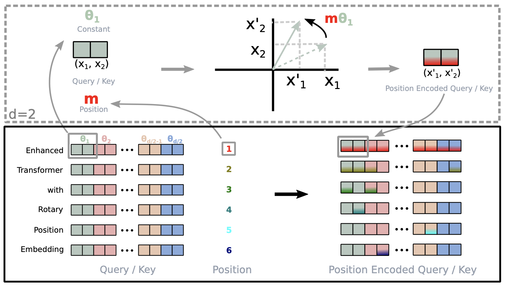
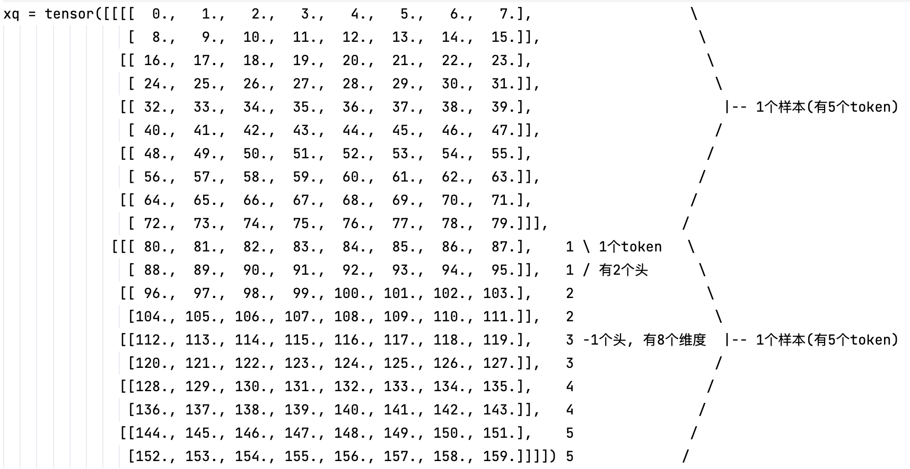
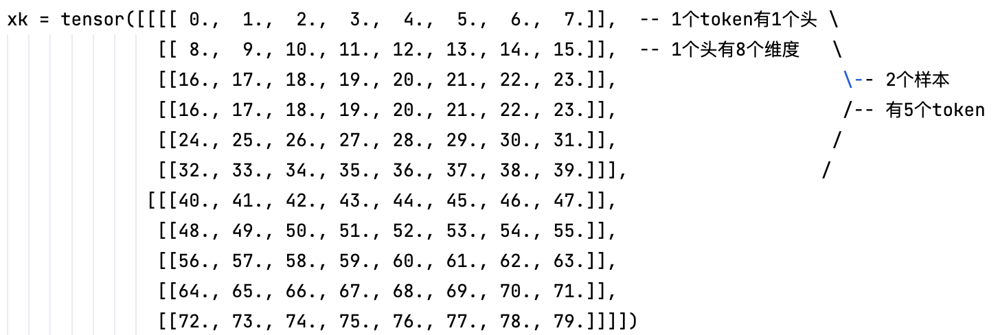
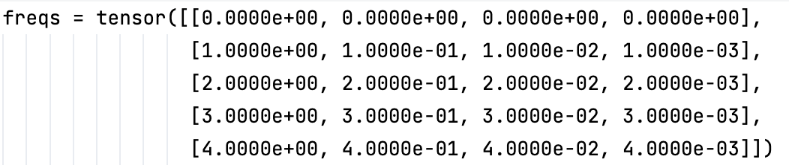
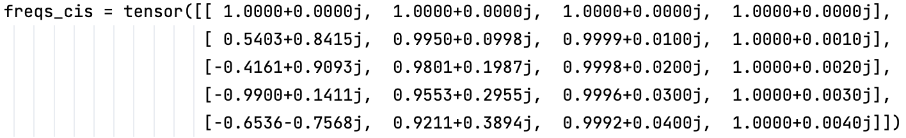
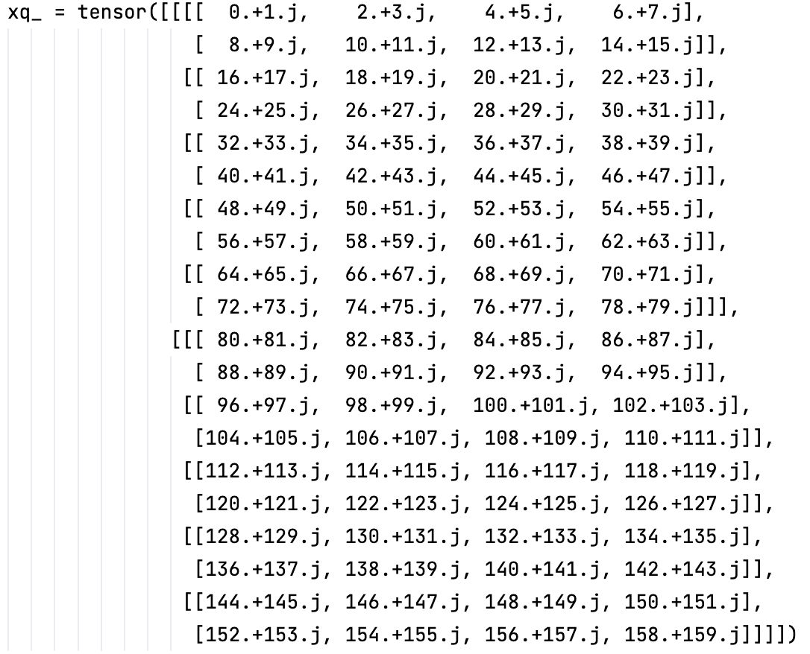
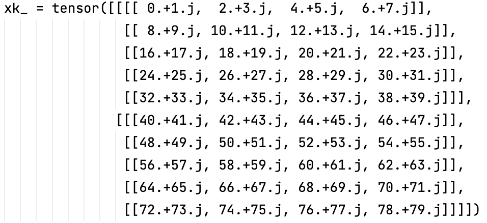
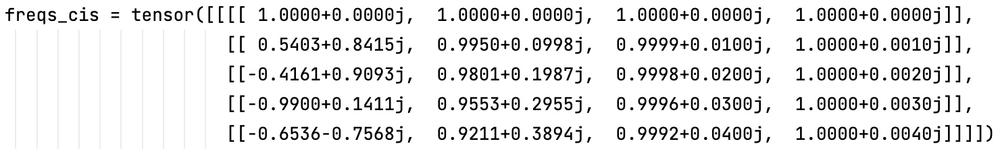
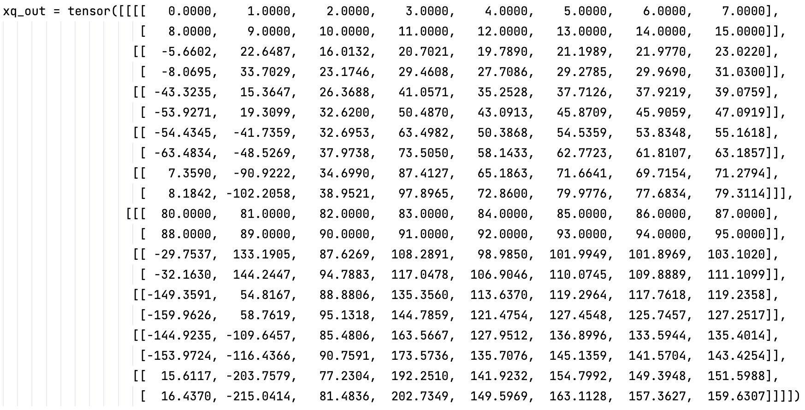
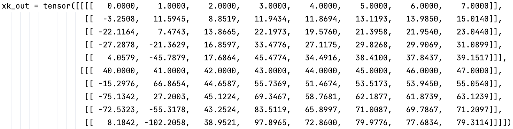

# 位置编码

[LLaMA官方实现的旋转位置编码代码(内含详细注释及演示案例)](../script/modeling/model_utils/RoPE.py)

## 基本概念

### 为什么要使用位置编码？

嵌入层将词元(的编码)转换为一个固定大小的嵌入向量，相应地，一段文本就被转换为一个嵌入向量序列(矩阵)。例如，一段文本被分词器划分为 $N$ 个词元，嵌入层将每个词元转换为一个 $d$ 维的向量。那么，这段文本就被转换为一个 $N \times d$ 的矩阵( $N$ 行 $d$ 列)。这种更高维的表示可以捕捉词元之间的语义关系，例如同作为宠物，“猫”和“狗”可能会被嵌入层映射到相近的向量空间中。

然而，仅仅使用嵌入层并不能很好地捕捉词元在句子中的位置信息。例如，“狗在追猫”和“猫在追狗”两句话的词元构成是一样的(只有顺序差别)，对应的嵌入向量序列也只有顺序的差别，但描述的场景有很大差别。也就是说，仅仅使用嵌入层捕捉语义信息，在词元顺序的表征上有些力不从心。

为了解决这个问题，可以使用位置编码(Positional Encoding)来为每个词元添加其位置表示。

### 位置编码如何工作？

对于一个含有 N 个词元的文本序列：

$$S_N = \\{ w_i \\}_{i = 1}^{N}$$

其中， $w_i$ 表示序列中的第 $i$ 个词元。而序列 $S_N$ 对应的嵌入向量表示为：

$$E_N = \\{ x_i \\}_{i = 1}^{N}$$

其中， $x_i$ 表示序列中的第 $i$ 个词元对应的 $d$ 维嵌入向量(每个 $x_i$ 都是一个 $d$ 维向量)。

在自注意力机制中，我们会首先使用嵌入向量计算 $q, k, v$ (这一点暂时不需要特别深入理解，只要知道会有这样的一步计算即可，后面会详细讲到)。就在这个过程中，我们会通过位置编码的方式加入位置信息，使计算得到的 $q, k, v$ 是包含词元位置信息的。即：

$$q_m = f_q (x_m, m)$$

$$k_n = f_k (x_n, n)$$

$$v_n = f_v (x_n, n)$$

其中， $q_m$ 是文本序列中第 $m$ 个词元对应的嵌入向量 $x_m$ 集成了位置信息 $m$ 之后生成的 query (查询)向量； $k_n$ 和 $v_n$ 则分别是第 $n$ 个词元对应的嵌入向量 $x_n$ 集成位置信息 $n$ 之后生成的 key (键)和 value (值)向量。

**位置编码方法的关键点就是构造一个合适的函数 $f$，将位置信息集成到 $q$ 、 $k$ 和 $v$ 中。**

在自注意力机制中，比如要计算第 $m$ 个词元的嵌入向量 $x_m$ 对应的自注意力输出结果，即是对 $q_m$ 和所有 $k_n$ 进行点积运算，然后通过 softmax 函数归一化，得到 $n$ 个注意力分数，最后乘以对应的 $v_n$ 并求和：

$$a_{m,n} = \frac{\exp \left(\frac{q_m^T k_n}{\sqrt{d}} \right) }{\sum_{j=1}^N \exp \left( \frac{q_m^T k_j}{\sqrt{d}} \right) }, n =1, ..., N.$$

$$o_m = \sum_{n=1}^N a_{m,n} v_n.$$

## 绝对位置编码

绝对位置编码直接为序列中的每个位置分配一个固定的编码向量，表示该位置在序列中的绝对索引。其核心特点是：每个位置都有一个独立的编码，模型依赖这些编码来区分不同位置的元素。绝对位置编码的缺点是：绝对位置编码通常难以很好地捕捉序列中元素之间的相对位置关系。

原始Transformer论文中提到的基于 Sinusoidal 函数生成位置编码的方式，是一种典型的绝对位置编码方法。绝对位置编码有如下的特点：
 - 固定性：位置编码在整个训练和推理过程中都是固定的，不会被更新；
 - 可扩展性：由于 Sinusoidal 函数的周期性质，这种方法可以潜在地泛化到比训练期间遇到的更长的序列长度上，这对于处理“变长”序列特别有用；
 - 加法方式：通常情况下，绝对位置编码会直接加到词嵌入上，作为输入的一部分传递给模型的第1层。

简言之，Sinusoidal 位置编码是在计算 $q$、 $k$ 和 $v$ 之前，预先计算一个位置编码向量 $p_i$ ( $p_i$ 与嵌入向量 $x_i$ 的维度一样，都是 $d$ 维的)与嵌入向量 $x_i$ 直接相加，再乘以相应的变换矩阵 $W_{\\{q,k,v\\}}$ 即得到  $q$、 $k$ 和 $v$ ：

$$q_m = f_q(x_m, m) = W_q (x_m + p_m)$$

$$k_n = f_k(x_n, n) = W_k (x_n + p_n)$$

$$v_n = f_v(x_n, n) = W_v (x_n + p_n)$$

而其中位置编码向量 $p_i$ 的计算方法如下：

$$p_{i,2t} = \sin \left( \frac{i}{10000^{2i/d}} \right) $$

$$p_{i,2t+1} = \cos \left( \frac{i}{10000^{2i/d}} \right) $$

其中， $p_{i,2t}$ 对应于第 $i$ 个词元的嵌入向量 $x_i$ 的第 $2t$ 位置(偶数索引位置)的位置编码； $p_{i,2t+1}$ 对应于第 $i$ 个词元的嵌入向量 $x_i$ 的第 $2t+1$ 位置(奇数索引位置)的位置编码； $d$ 是嵌入向量的维度； $\\{ 2t, 2t+1\\} \subset \\{1, 2, ..., d\\}$ 。

这种编码方式确保了对于任何固定的偏移量(后面一个词元相对于前面某个词元的位置偏移距离) $k$ ，后一个词元的位置编码 $p_{i+k}$ 都可以表示为前面第 $i$ 个词元的位置编码 $p_i$ 的线性函数。

## 旋转位置编码

与绝对位置编码相对的是相对位置编码。从上面的绝对位置编码的介绍中，我们可以看出，绝对位置编码的缺点是难以捕捉序列中元素之间的相对位置关系。而相对位置编码关注的是序列中元素之间的相对距离，而不是它们的绝对位置。这种方法更符合人类语言理解的方式，因为在自然语言中，相对位置往往比绝对位置更重要。例如，“狗在追猫”和“猫被狗追”，重要的不是单词的绝对位置，而是它们之间的相对顺序。

旋转位置编码(Rotary Position Embedding, RoPE)是当前最常见的相对位置编码方法。它通过将位置信息整合到自注意力机制中，克服了传统绝对位置编码的一些缺点，在多个方面提升了Transformer模型的性能表现。

前面已经了解到，在自注意力机制中，我们会用到 $q_m$ 和 $k_n$ 的内积运算(参见 $a_{m,n}$ 的计算公式)。为了能够利用词元之间的相对位置信息，我们首先假设  $q_m$ 和 $k_n$ 的内积运算可以用一个函数 $g$ 来表示。而该函数 $g$ 的输入是嵌入向量 $x_m$ 、 $x_n$ 和它们之间相对位置 $m-n$ ，而与它们的绝对位置 $m$ 和 $n$ 无直接关系。即：

$$q_m^T k_n = \left< f_q(x_m, m), f_k(x_n, n) \right> = g(x_m, x_n, m-n)$$

剩下的问题就是：找到一种位置编码方式(即 $f$ 和 $g$ 的函数形式)，使得上式成立(记作**问题(1)**)。

为了简化问题但不失一般性，我们暂且假定嵌入向量的维度 $d=2$。基于二维平面上的向量几何性质，可以很容易找到满足上述关系的 $f$ 和 $g$，形式如下：

$$f_q(x_m, m) = (W_q x_m)e^{im \theta}$$

$$f_k(x_n, n) = (W_k x_n)e^{in \theta}$$

$$g(x_m, x_n, m-n) = \text{Re} \left[ (W_qx_m)(W_kx_n)^* e^{i(m-n) \theta} \right]$$

其中， $\text{Re}$ 表示取复数的实部； $(W_kx_n)^*$ 表示复数 $W_kx_n$ 的共轭( $a+ib$ 的共轭为 $a-ib$ )。

### 证明过程

已知欧拉公式：

$$e^{ix} = \cos x + i\sin x$$

其中， $x$ 表示任意实数， $e$ 是自然对数的底数， $i$ 是复数中的虚数单位。也就是说，指数函数可以表示为实部为 $\cos x$ 、虚部为 $\sin x$ 的复数。欧拉函数建立了指数函数、三角函数和复数之间的关系。根据欧拉公式，可知：

$$e^{im\theta} = \cos(m\theta) + i \sin(m \theta)$$

$$e^{in\theta} = \cos(n\theta) + i \sin(n \theta)$$

$$e^{i(m-n)\theta} = \cos[(m-n)\theta] + i \sin[(m-n) \theta]$$

对于前面的公式 $q_m = f_q(x_m, m) = (W_q x_m)e^{im \theta}$ ，已知 $W_q$ 是一个 $2 \times 2$ 的矩阵， $x_m$ 是一个2维向量。那么 $W_q$ 与 $x_m$ 相乘的结果(记作 $q_m^*$ )也是一个2维向量，即：

而 $q_m^*$ 作为一个2维向量，还可以表示成复数形式：

因此可以得到：

由此可见， $q_m$ 实际上 query 向量乘以一个旋转矩阵。这也是为什么这种方法被称为“旋转位置编码”的原因。

同理，可以得到 $k_n$ 的表达式：

最后，对 $g(x_m, x_n, m-n)$ 已知：

$$g(x_m, x_n, m-n) = \text{Re} \left[ (W_qx_m)(W_kx_n)^* e^{i(m-n) \theta} \right]$$

其中， $\text{Re}$ 表示取复数的实部； $(W_kx_n)^*$ 表示复数 $W_kx_n$ 的共轭。由此可得到 $g(x_m, x_n, m-n)$ 的各个部分：

$$W_qx_m = q_m^* = q_m^{ * (1)} + iq_m^{ * (2)}$$

$$W_kx_n = k_n^* = k_n^{ * (1)} + ik_n^{ * (2)}$$

$$e^{i(m-n)\theta} = \cos((m-n)\theta) + i\sin((m-n)\theta)$$

将上述三个部分代入 $g(x_m, x_n, m-n)$ ，可以得到：

而将之前推导得到的 $q_m$ 和 $k_n$ 的表达式代入 $q_m^T k_n = \left< f_q(x_m, m), f_k(x_n, n) \right>$ ，可以得到：

显然，在二维平面找到的 $f$ 和 $g$：

$$f_q(x_m, m) = (W_q x_m)e^{im \theta}$$

$$f_k(x_n, n) = (W_k x_n)e^{in \theta}$$

$$g(x_m, x_n, m-n) = \text{Re} \left[ (W_qx_m)(W_kx_n)^* e^{i(m-n) \theta} \right]$$

解决了**问题(1)**。

且可以得到 $q_m^T k_n = \left< f_q(x_m, m), f_k(x_n, n) \right>$ 的矩阵向量乘积表达式为：

### 拓展到 $d>2$

上面的证明和推导过程是基于 $d=2$ 的假设，对于 $d>2$ 的情况，则需要将词嵌入向量的元素按两两一组进行分组，每组分别应用上述的二维旋转编码操作方法。由此可得到一般化的 $f$ ：

其中，

其中， $\Theta = \\{ \theta_t = 10000^{-2(t-1)/d},\quad i \in \\{1,2,...,d\\} \\}$ 是预设的旋转角度。

在自注意力机制中，我们近一步有：

其中， 

### 实现方法

综上所述，旋转位置编码在自注意力机制中的具体实现流程如下：
  - 对文本序列中的每个词元对应的嵌入向量计算其对应的 query 和 key 向量；
  - 对每个词元所在位置都计算对应的旋转位置编码；
  - 对 query 和 key 向量的元素按照两两一组应用旋转变换；
  - 计算 query 和 key 向量的内积，得到注意力分数。

### 具体案例

假设每次处理的文本为2条，即批量大小=2，处理的最大文本块长度=5，模型的嵌入维度=16，多头自注意力机制中头的个数(即Query的头的个数)=2，多头自注意力机制中的分组数量(Query被分为query_group_num个组, 每组对应1个Key和Value)=2，旋转位置编码中使用的theta值=10000.0。

(1) 假设我们有如下的 query 张量 xq 和 key 张量 xk:

其中，xq是一个形状为(2, 5, 2, 8)的张量，代表2个样本(批量大小)，每个样本有5个token(文本块长度)，每个token有2个头，每个头的嵌入维度为8.

xk是一个形状为(2, 5, 1, 8)的张量，代表2个样本(批量大小)，每个样本有5个token(文本块长度)，每个token有1个头，每个头的嵌入维度为8.

(2) 预先计算位置编码的复数形式笛卡尔坐标
  - 计算旋转角度 freqs：
  其中的第 $i$ 个元素的计算方法为: $1 / (10000.0 ^ {(2 (i - 1) / 8)})$。 $i$ 的取值从 1 到 4.
  得到 freqs = tensor([1.0000, 0.1000, 0.0100, 0.0010]).
  - 创建一个长度为 5 (也可以是长度大于 5 的，但在后续使用中只截取前面 5 个)的张量 t, 其中的每个元素为其所在位置序号, 即从0到4.
  得到的 t = tensor([0, 1, 2, 3, 4]).
  - 计算位置序号 t 与旋转角度 freqs 的乘积(外积, 其中的元素是t中的每个元素与freqs中的每个元素相乘的结果)

 - 将上一步计算的极坐标 freqs 转换为笛卡尔坐标(用复数表示，实部为cos(freq)，虚部为sin(freq))

(3) 用预先计算的角度 freqs_cis 来对 xq 和  xk 进行旋转位置嵌入 (因为这里提供的 freqs_cis 与 xq 和 xk 长度一样，所以不需要进行裁剪，否则应该裁剪为与 xq 和 xk 长度一样)

 - 将 xq 和 xk 转换为复数形式，以 xq 的转换为例
   - a. 将 xq 的形状(2, 5, 2, 8)除了最后一个维度展开成一系列参数, 即得到 2, 5, 2
   - b. 将 xq 的形状从(2, 5, 2, 8)变为(2, 5, 2, 4, 2), 其中-1表示自动计算该维度的大小, 即4.
     也即是说, xq 的每个头的嵌入维度 8 被拆分为 4 组, 每组 2 个维度.
   - c. 将实数张量转换为复数张量, 如果 xq 最后一个维度的大小是2, 如[a, b] 则对应输出 a + bi.
   - d. 最终的输出结果形状是(2, 5, 2, 4).

 - 根据 xq_ 将预先计算好的旋转角度 freqs_cis 修改成特定形状(与xq_中每个批次、每个头对应的张量形状一样).
   这里 xq_ 的形状为 (2, 5, 2, 4), 则 freqs_cis 的形状为 (1, 5, 1, 4).

 - 计算 xq 和 xk 的旋转嵌入，以 xq 的计算为例
   - a. 计算 xq_ 与 freqs_cis 的复数乘法, 它将 xq_ 中的每个元素与 freqs_cis 中的对应元素相乘.
     例如, xq_ 中位置为 (0, 1, 1, 2) 的元素为 28.+29.j, 需要与 freqs_cis 中位于 (0, 1, 0, 2) 的元素 0.9999+0.0100j 相乘(由于小数位数原因, 实际上这个元素是 0.99995+0.009999833j)它们的乘积为 27.7086+29.2785j.
   - b. 将复数张量转换为实数张量。如果复数张量中的元素是 a + bi, 那转换后的实数张量是一个形如 [a, b] 的向量。
   - c. 将张量在第 3 维上进行展平, 即把第 3 维及其之后的所有维度展平成一个维度.
     例如, 待展平的张量形状是 (2, 5, 2, 4, 2), 第 3 维上进行展平操作之后的张量形状是 (2, 5, 2, 8). 根据上面的计算, 得到的 xq_out 中位置在 (0, 1, 1, 4:6) 的元素应该是 [27.7086, 29.2785]. 

对比 xk 和 xk_out, 可以看出：
 - 旋转位置编码的嵌入, 在第1个token(即位置为0)上, 与原始的嵌入是一致的;
 - 在后面的token上, 嵌入发生了变化. 其中嵌入向量中越靠前的元素变化程度越大，而越靠后的元素变化程度越小. 
 - 不同样本同一个位置的token，旋转角度是相同的. 

## 参考文献
[ROFORMER: ENHANCED TRANSFORMER WITH ROTARY POSITION EMBEDDING.](https://arxiv.org/pdf/2104.09864)
[一文看懂 LLaMA 中的旋转式位置编码(Rotary Position Embedding)](https://zhuanlan.zhihu.com/p/642884818)
[LLaMA 官方实现代码](https://github.com/meta-llama/llama/tree/main)
