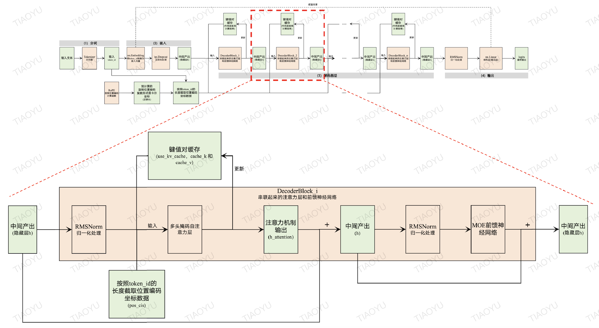

# 解码器模块(Decoder Block)

## 基本概念

解码器模块是大语言模型的主体。从[「模型架构」](2-模型构建.md)看，除了不参与大语言模型训练的分词器(需要在大语言模型构建之前就训练好)，以及嵌入层和最后作为输出层的线性层，大语言模型其余的部分都是由多个结构重复的解码器模块依次组合而成的。解码器模块的个数直接决定了大语言模型的深度。

每个解码器模块由两个核心部分组成: 多头掩码自注意力机制和MOE前馈神经网络，

## 计算流程

解码器模块的具体计算流程如下所示：

(1) 初始输入数据：
 - Dropout处理之后的嵌入向量——隐藏层 $h$ (对应解码器块前向传播方法的输入参数 $x$);
 - 按照token_id的长度截取的位置编码坐标数据 $freqs_cis\_cis$ ;
 - 是否使用键和值张量缓存的布尔值 $use\_kv\_cache$ ;
 - 键和值张量缓存 $cache\_k$ 和 $cache\_v$.

(2) 对输入张量 $x$ 进行 RMS 归一化处理，得到新的 $x$；

(3) 将(2)的结果 $x$ ，$freqs_cis\_cis$ 、 $use\_kv\_cache$  、 $cache\_k$ 和 $cache\_v$ 作为参数，传入[多头掩码自注意力](10-多头掩码自注意力机制.md)计算模块，得到注意力计算结果 $h\_attention$ 、 新的键和值张量缓存 $cache\_k$ 和 $cache\_v$ ；

(4) 将注意力机制输出 $h\_attention$ 与原始输入张量(输出参数) $x$ 相加，得到新的 $h$ ；

这种相加是一种常见的设计，这种做法主要有以下4个方面的意义：
 - 保留原始信息：直接相加有助于保留输入中的原始信息，避免通过多层网络后丢失重要的特征。这样做可以确保模型不仅仅依赖于注意力机制生成的新特征表示，还能结合原始输入的特征，从而丰富最终的特征表达。
 - 简化模型结构：相比于直接将注意力机制的输出和原始输入拼接起来再通过一层线性变换来调整维度，简单地进行相加操作减少了参数数量和计算复杂度，有助于简化模型结构，同时也能一定程度上减少过拟合的风险。
 - 增强特征表达：通过注意力机制对某些特定部分的信息进行强调或抑制，然后将其结果与原始输入相结合，可以使模型更加关注于输入中最重要的部分，从而增强特征的表达能力，提高模型的性能。
 - 梯度流动：在训练深度神经网络时，保持良好的梯度流对于模型的有效训练至关重要。将注意力机制的输出与原始输入相加有助于维持一个较为稳定的梯度流动路径，有利于训练更深的网络结构。

(5) 将(4)的结果 $h$ 经过 RMS 归一化处理，并输入到[MOE前馈神经网络](11-MOE前馈神经网络.md)计算模块，然后将得到前馈神经网络的输出与(4)的结果 $h$ 相加(设计原理同(4))，得到最终结果 $block\_h$ ；

(6) 返回 $block\_h$ 、 $cache\_k$ 和 $cache\_v$ 。

$block\_h$ 作为入参输入到下一个解码器模块， $cache\_k$ 和 $cache\_v$ 作为新的键和值张量缓存更新原有缓存。不断迭代，直至遍历所有串联的解码器模块。

